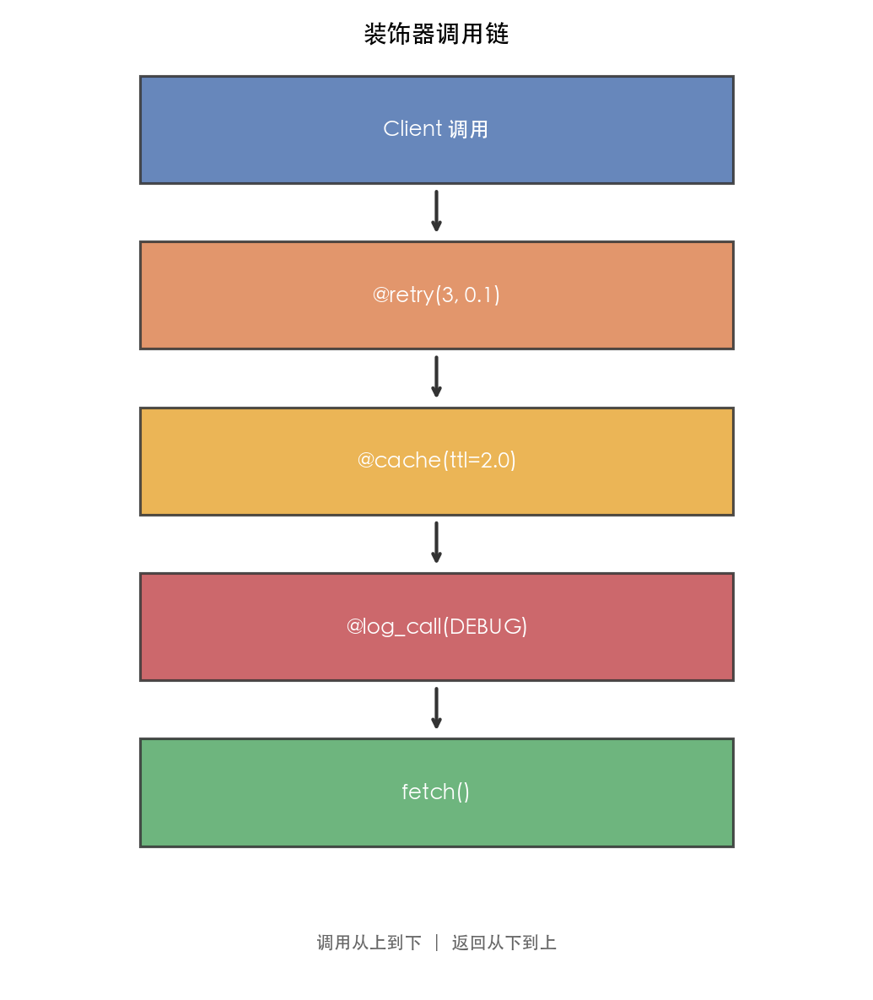
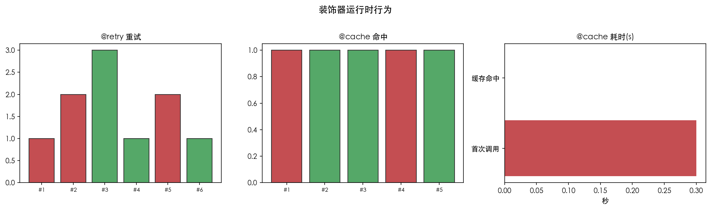

# 01 · 装饰器工厂：三层嵌套实现带参数的装饰器

## 1. 引言

装饰器是 Python 面试中最常考的语言特性之一。它本质上是一个**高阶函数**——接收函数作为参数，返回一个新函数，在不修改原函数代码的前提下增强其功能。

带参数的装饰器（装饰器工厂）是装饰器的高级用法，需要三层函数嵌套：外层接收装饰器参数，中层接收被装饰函数，内层是实际的包装函数。

本文实现三个经典带参装饰器：`@retry`（失败重试）、`@cache`（带过期缓存）、`@log_call`（日志控制），并通过可视化展示装饰器调用链和运行时行为。

## 2. 文件结构

```
01_decorator_factory/
├── README.md              # 本教程文档
├── decorator_factory.py   # 主演示脚本：@retry / @cache / @log_call 三个带参装饰器
├── scripts/
│   └── gen_diagram.py # 示意图生成脚本（调用链图 + 运行时行为图）
└── images/
    ├── decorator_arch.png     # 装饰器调用链图（由 gen_diagram.py 生成）
    └── decorator_runtime.png  # 运行时行为可视化（由 gen_diagram.py 生成）
```

主脚本内容：

```
decorator_factory.py
├── 1. retry(times, delay)   # 失败重试装饰器
├── 2. cache(ttl)            # 带过期时间的缓存装饰器
├── 3. log_call(level)       # 日志级别控制装饰器
├── 4. 演示函数              # fetch / compute / add
└── 5. main()                # 主入口（只跑 demo）
```

## 3. 核心概念

### 3.1 三层嵌套结构

```python
def decorator_factory(param):        # 第1层：接收装饰器参数
    def decorator(func):             # 第2层：接收被装饰函数
        @functools.wraps(func)
        def wrapper(*args, **kwargs):  # 第3层：实际包装逻辑
            return func(*args, **kwargs)
        return wrapper
    return decorator
```

**执行顺序**：
1. `@retry(times=3, delay=0.1)` → 调用 `retry(3, 0.1)` → 返回 `decorator`
2. `@decorator` → 调用 `decorator(fetch)` → 返回 `wrapper`
3. 调用 `fetch(url)` → 实际执行 `wrapper(url)`

### 3.2 functools.wraps 的作用

```python
@functools.wraps(func)
def wrapper(*args, **kwargs):
    ...
```

`wraps` 将原函数的 `__name__`、`__doc__` 等元信息复制到 wrapper，否则：
- `func.__name__` 会变成 `"wrapper"` 而非原函数名
- 调试和日志中无法识别原函数

### 3.3 三个装饰器详解

#### @retry —— 失败重试

```python
def retry(times=3, delay=0.5):
    def decorator(func):
        @functools.wraps(func)
        def wrapper(*args, **kwargs):
            for attempt in range(1, times + 1):
                try:
                    return func(*args, **kwargs)
                except Exception as e:
                    if attempt == times:
                        raise
                    time.sleep(delay)
        return wrapper
    return decorator
```

**关键点**：
- 循环 `times` 次尝试
- 最后一次失败才抛出异常
- 每次失败后等待 `delay` 秒

#### @cache —— 带过期缓存

```python
def cache(ttl=60.0):
    def decorator(func):
        cache_store = {}  # 闭包变量，持久化缓存

        @functools.wraps(func)
        def wrapper(*args, **kwargs):
            key = f"{args}:{kwargs}"
            now = time.time()
            if key in cache_store:
                timestamp, value = cache_store[key]
                if now - timestamp < ttl:
                    return value  # 缓存命中
            result = func(*args, **kwargs)
            cache_store[key] = (now, result)
            return result
        return wrapper
    return decorator
```

**关键点**：
- `cache_store` 是闭包变量，在多次调用间持久存在
- 用 `(timestamp, value)` 元组存储，支持 TTL 过期

#### @log_call —— 日志控制

```python
def log_call(level="INFO"):
    def decorator(func):
        @functools.wraps(func)
        def wrapper(*args):
            print(f"  [{level}] {func.__name__}({args})")
            result = func(*args)
            print(f"  [{level}] → {result}")
            return result
        return wrapper
    return decorator
```

**关键点**：
- 装饰器参数 `level` 在闭包中持久化
- 调用前后各输出一条日志

### 3.4 高频追问

**Q1: 多个装饰器的执行顺序？**

```python
@decorator_a
@decorator_b
def func(): pass
```

等价于 `func = decorator_a(decorator_b(func))`

**调用时**：先执行 decorator_a 的 wrapper，内部调用 decorator_b 的 wrapper，最后调用 func。

**Q2: 类装饰器怎么写？**

```python
class Retry:
    def __init__(self, times=3):
        self.times = times

    def __call__(self, func):
        @functools.wraps(func)
        def wrapper(*args, **kwargs):
            for i in range(self.times):
                try:
                    return func(*args, **kwargs)
                except: pass
        return wrapper
```

**Q3: 装饰器能装饰类吗？**

可以。装饰器接收类作为参数，返回新类：

```python
def singleton(cls):
    instances = {}
    @functools.wraps(cls)
    def wrapper(*args, **kwargs):
        if cls not in instances:
            instances[cls] = cls(*args, **kwargs)
        return instances[cls]
    return wrapper
```

## 4. 实操演示

```bash
cd interview/01_decorator_factory
python3 decorator_factory.py      # 运行三个装饰器的 demo
python3 scripts/gen_diagram.py # 重新生成 images/ 下两张图
```

真实输出示例（macOS, CPython 3.10）：

```
=== 装饰器工厂 ===

1. @retry:
  → OK from https://api.example.com

  第1次失败: 连接 https://api.example.com 失败, 0.1s后重试
  → OK from https://api.example.com

2. @cache:
  首次: 1024 (0.30s)
  缓存: 1024 (0.00s)

3. @log_call:
  [DEBUG] add((3, 4))
  [DEBUG] → 7
```

## 5. 预期结果与陷阱



调用链图展示装饰器的嵌套关系：调用从上到下（Client → @retry → @cache → @log_call → 原函数），返回从下到上。



运行时行为图三面板：
- **左图**：@retry 的重试行为（红色=失败，绿色=成功）
- **中图**：@cache 的命中/未命中（绿色=命中，红色=未命中）
- **右图**：@cache 首次调用 ~0.30s vs 缓存命中 ~0.00s 的耗时对比

诚实预期（本机实测）：

- **@retry 的输出每次都不一样**：demo 里 `fetch` 用 `random.random() < 0.6` 模拟 60% 失败率，所以每次运行的重试次数、甚至是否成功都是随机的——两次调用都直接成功也属正常
- **@cache 的加速稳定可复现**：首次调用因 `time.sleep(0.3)` 约 0.30s，缓存命中约 0.00s
- 两张图中的重试/命中序列是**示意数据**（展示行为模式），不是本次运行的实录

## 6. 小结

1. **装饰器本质是高阶函数**，三层嵌套实现带参装饰器
2. **functools.wraps 保留元信息**，调试时至关重要
3. **闭包变量持久化状态**，如 cache_store、重试计数
4. **装饰器链从下到上包裹**，调用时从上到下执行
5. **类装饰器用 `__call__`** 实现，功能与函数装饰器等价

下一篇进入 02_context_manager：看 `with` 语句背后的 `__enter__` / `__exit__` 协议。
