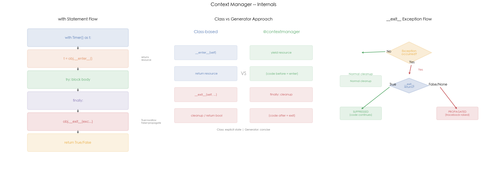

# 02 · 上下文管理器：with 语句背后的 `__enter__` / `__exit__` 协议

## 1. 引言

上下文管理器是 Python 中保证资源正确获取和释放的机制。`with` 语句背后的核心协议是 `__enter__` 和 `__exit__` 两个魔法方法——无论代码块是否抛出异常，`__exit__` 都会被调用，从而实现"异常安全"的资源管理。

Python 提供两种实现方式：**类式**（定义 `__enter__`/`__exit__`）和**函数式**（`@contextmanager` + `yield`）。两者功能等价，选择取决于代码复杂度——简单场景用函数式更简洁，需要维护状态的复杂场景用类式更清晰。

## 2. 文件结构

```
02_context_manager/
├── README.md              # 本教程文档
├── context_manager.py     # 主演示脚本：类式/函数式上下文管理器 + contextlib 工具
├── scripts/
│   └── gen_diagram.py # 示意图生成脚本（三面板机制图）
└── images/
    └── context_manager.png  # 三面板可视化（由 gen_diagram.py 生成）
```

主脚本内容：

```
context_manager.py
├── 1. Timer               # 计时器（类式，自动打印耗时）
├── 2. FileLock            # 文件锁（类式，threading.Lock）
├── 3. Transaction         # 数据库事务（类式，自动 commit/rollback）
├── 4. temporary_file()    # 临时文件（@contextmanager，自动删除）
├── 5. benchmark()         # 性能计时（@contextmanager，异常安全）
├── 6. demo_suppress()     # contextlib.suppress 示例
├── 7. demo_redirect()     # redirect_stdout 示例
├── 8. demo_nested()       # 嵌套上下文管理器
└── 9. demo_exit_return()  # __exit__ 返回值对异常传播的影响
```

## 3. 核心概念

### 3.1 类式上下文管理器协议

```python
class MyResource:
    def __enter__(self):
        # 获取资源
        return resource

    def __exit__(self, exc_type, exc_val, exc_tb):
        # 释放资源（无论是否异常）
        # return True  → 异常被吞掉
        # return False → 异常继续传播
        cleanup()
```

`with` 语句的执行流程：
1. 调用 `obj.__enter__()`，返回值绑定到 `as` 后的变量
2. 执行 `with` 块内的代码
3. 无论是否异常，调用 `obj.__exit__(exc_type, exc_val, exc_tb)`
4. 如果 `__exit__` 返回 `True`，异常被吞掉；返回 `False` 或 `None`，异常继续传播

**Transaction 示例**（自动 commit/rollback）：

```python
class Transaction:
    def __exit__(self, exc_type, exc_val, exc_tb):
        if exc_type is None:
            self.committed = True    # 正常 → commit
        else:
            self.rolled_back = True  # 异常 → rollback
        return True  # 事务回滚后不再传播异常
```

### 3.2 函数式：@contextmanager 原理

```python
@contextmanager
def my_resource():
    # __enter__ 阶段
    resource = acquire()
    try:
        yield resource  # ← 返回给 with ... as x
    finally:
        # __exit__ 阶段（无论异常与否）
        release(resource)
```

`yield` 之前的部分相当于 `__enter__`，`yield` 的值绑定到 `as` 变量，`finally` 块相当于 `__exit__`。

### 3.3 类式 vs 函数式对比

| 维度 | 类式 | 函数式 |
|:---|:---|:---|
| 语法 | 定义 `__enter__`/`__exit__` | `@contextmanager` + `yield` |
| 状态管理 | 用实例属性 `self.xxx` | 用闭包变量 |
| 适用场景 | 复杂状态、需要 `__exit__` 返回值控制异常 | 简单的获取/释放模式 |
| 异常控制 | `__exit__` 返回 `True/False` | 默认 `finally` 行为（不吞异常）；在 `yield` 外套 `try/except` 可吞 |

**关键差异**：类式用 `__exit__` 的返回值直观地控制异常传播；函数式默认异常会传播，需要手动把 `yield` 包进 `try/except` 才能吞掉（见脚本 `benchmark()` 的写法）。

### 3.4 contextlib 工具

```python
# suppress: 优雅地忽略特定异常
with suppress(FileNotFoundError):
    os.remove("maybe_exists.txt")
# 等价于 try/except FileNotFoundError: pass

# redirect_stdout: 捕获 print 输出
buf = io.StringIO()
with redirect_stdout(buf):
    print("captured")
captured = buf.getvalue()
```

### 3.5 高频追问

**Q1: with 语句和 try/finally 有什么区别？**

`with` 是 `try/finally` 的语法糖，但更语义化：

```python
# with 语句
with open("file.txt") as f:
    data = f.read()

# 等价于
f = open("file.txt")
try:
    data = f.read()
finally:
    f.close()
```

**Q2: @contextmanager 能否吞异常？**

不能直接通过 `finally` 吞异常。必须在 `yield` 后用 `try/except` 捕获：

```python
@contextmanager
def swallow_errors():
    try:
        yield
    except Exception:
        pass  # 吞异常
```

但这会让 `with` 块内的异常被隐藏，实际中应谨慎使用。

**Q3: 多个 with 可以嵌套吗？**

可以，Python 3.1+ 支持多行写法：

```python
with A() as a, B() as b:
    ...
# 等价于
with A() as a:
    with B() as b:
        ...
```

**Q4: __exit__ 的三个参数是什么？**

```python
def __exit__(self, exc_type, exc_val, exc_tb):
    # exc_type: 异常类 (如 ValueError)
    # exc_val:  异常实例 (如 ValueError("bad"))
    # exc_tb:   异常回溯链 (traceback)
    # 如果无异常，三者都为 None
```

## 4. 实操演示

```bash
cd interview/02_context_manager
python3 context_manager.py     # 运行全部 demo（Timer/事务/临时文件/异常传播）
python3 scripts/gen_diagram.py # 重新生成 images/context_manager.png
```

真实输出示例（macOS, CPython 3.10，节选）：

```
[1] Timer:
  [sort_10k] 0.0001s
  [sort_100k] 0.0011s

[2] Transaction (class-based):
  [TX:insert_user] BEGIN
  [TX:insert_user] COMMIT (2 ops)
  committed=True

  Transaction with error:
  [TX:fail] BEGIN
  [TX:fail] ROLLBACK (RuntimeError: connection lost)
  committed=False, rolled_back=True

[3] Temporary file (@contextmanager):
  [tempfile] created: .../_tmp_ctx_96528.txt
  content: Hello, context!
  file exists: True
  [tempfile] deleted: .../_tmp_ctx_96528.txt
  after with, file exists: False

[4] Benchmark (@contextmanager):
  [bench:list_comp] 0.0091s [OK]
  [bench:failing_op] 0.0094s [FAIL]
  errors captured: ['oops']

[7] __exit__ return value:
  [1] swallow=True (异常被吞):
    [swallower] swallowed: ZeroDivisionError: division by zero
    code after with: reached (exception swallowed)
  [2] swallow=False (异常传播):
    ZeroDivisionError propagated (as expected)
```

## 5. 预期结果与陷阱



上图三面板展示上下文管理器的核心机制：
- **左图 — with Statement Flow**：`with` 语句的执行流程。从 `with Timer() as t` 开始，依次调用 `__enter__` 获取资源 → 执行 `try` 块内代码 → `finally` 调用 `__exit__` 清理 → 根据 `__exit__` 返回值决定异常是否传播
- **中图 — Class vs Generator**：类式和函数式两种实现的对比。类式用 `__enter__`/`__exit__` 方法，适合需要维护状态的复杂场景；函数式用 `yield` 分隔 enter/exit 逻辑，代码更简洁，但吞异常需要手动把 `yield` 包进 `try/except`
- **右图 — Exception Flow**：`__exit__` 的异常传播决策树。如果代码块无异常，直接 cleanup；有异常时根据 `__exit__` 返回值决定：`True` = 抑制异常（代码继续），`False/None` = 传播异常（触发 traceback）

诚实预期（本机实测）：

- **Timer / benchmark 的耗时数值每次运行都会波动**（受机器负载影响），量级（10k 排序 ~0.0001s、100k ~0.001s）才是关注点
- commit/rollback、临时文件删除、异常吞/传播等行为是确定性的，每次运行结果一致
- `FileLock` 只是演示类，本机没有真实的多进程文件锁竞争场景可观察

## 6. 小结

1. **with 语句 = 异常安全的 try/finally**，保证资源释放
2. **类式用 `__enter__`/`__exit__`**，函数式用 `@contextmanager` + `yield`
3. **`__exit__` 返回 True 吞异常**，返回 False/None 传播异常
4. **`@contextmanager` 更简洁**，但无法控制异常传播
5. **`contextlib.suppress`** 是替代 `try/except pass` 的优雅写法

下一篇进入 03_descriptor：看描述符协议如何成为 property、方法绑定背后的底层机制。
