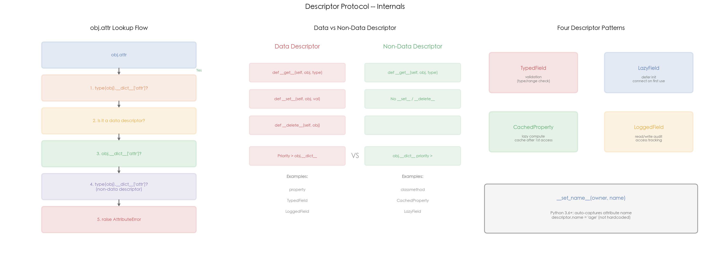

# 03 · 描述符协议：`obj.attr` 背后的属性访问底层机制

## 1. 引言

描述符是 Python 属性访问的底层机制。当你写 `obj.attr` 时，Python 不是简单地查 `obj.__dict__`——它会先检查 `type(obj).__dict__` 中对应的值是否是描述符。如果是，就调用描述符的 `__get__`/`__set__` 方法。这就是 `property`、`classmethod`、`staticmethod` 等内置装饰器的实现原理。

描述符分两类：
- **数据描述符**（data descriptor）：定义 `__set__` 或 `__delete__`（即使没有 `__get__`），优先级高于实例 `__dict__`
- **非数据描述符**（non-data descriptor）：只定义 `__get__`，实例 `__dict__` 优先

理解描述符是深入 Python 对象模型的关键，也是面试中区分"会用 Python"和"理解 Python"的经典题。

## 2. 文件结构

```
03_descriptor/
├── README.md              # 本教程文档
├── descriptor.py          # 主演示脚本：四种描述符模式 + 查找优先级演示
├── scripts/
│   └── gen_diagram.py # 示意图生成脚本（三面板机制图）
└── images/
    └── descriptor.png     # 三面板可视化（由 gen_diagram.py 生成）
```

主脚本内容：

```
descriptor.py
├── 1. TypedField          # 数据描述符：类型+范围验证
├── 2. CachedProperty      # 非数据描述符：计算后缓存
├── 3. LazyField           # 非数据描述符：惰性初始化
├── 4. LoggedField         # 数据描述符：读写审计日志
├── 5. User / DataProcessor / HeavyResource / TrackedEntity
├── 6. reveal_descriptor_nature()   # property/classmethod 本质
└── 7. demo_priority()               # 属性查找优先级演示
```

## 3. 核心概念

### 3.1 描述符协议三个方法

```python
class MyDescriptor:
    def __get__(self, obj, objtype=None):
        """obj.attr 触发"""
        if obj is None:
            return self  # 类访问: MyClass.attr
        return value

    def __set__(self, obj, value):
        """obj.attr = value 触发"""
        obj.__dict__["attr"] = value

    def __delete__(self, obj):
        """del obj.attr 触发"""
        obj.__dict__.pop("attr", None)
```

### 3.2 `__set_name__`（Python 3.6+）

```python
class TypedField:
    def __set_name__(self, owner, name):
        self.name = name  # 自动获取属性名

class User:
    age = TypedField()  # age.name 自动变为 "age"
```

不需要手动传属性名，Python 在类创建时自动调用 `__set_name__`。

### 3.3 四种实战模式

**TypedField —— 类型验证**

```python
class User:
    age = TypedField(type_=int, min_val=0, max_val=150)

u = User("Alice", 30, "alice@example.com")
u.age = "thirty"  # TypeError: expected int, got str
u.age = -1         # ValueError: must >= 0
```

TypedField 同时定义 `__get__` 和 `__set__`，是**数据描述符**——即使 `obj.__dict__` 中有同名 key，`obj.age` 仍走描述符逻辑。

**CachedProperty —— 计算缓存**：只定义 `__get__`，是**非数据描述符**。首次访问后结果存入 `obj.__dict__["stats"]`，之后实例字典优先——这是缓存生效的原因，也使 `obj.__dict__["stats"] = x` 可以覆盖缓存值。

**LazyField —— 惰性初始化**：属性名映射为 `_lazy_attr` 存入实例字典，首次访问才调用 factory，避免与描述符名称冲突。

**LoggedField —— 读写审计**：数据描述符，每次读/写自动追加日志，适合属性访问追踪场景。

### 3.4 属性查找优先级

```
obj.attr 的查找顺序:
1. type(obj).__dict__["attr"]  →  如果是 data descriptor → 调用 __get__
2. obj.__dict__["attr"]        →  直接返回
3. type(obj).__dict__["attr"]  →  如果是 non-data descriptor → 调用 __get__
4. raise AttributeError
```

简化版记忆口诀：**数据描述符 > 实例 `__dict__` > 非数据描述符**。

### 3.5 高频追问

**Q1: property 和描述符有什么关系？**

`property` 就是一个数据描述符：

```python
p = property(lambda self: self.x)
print(hasattr(p, "__get__"))   # True
print(hasattr(p, "__set__"))   # True
```

`@property` 是语法糖，等价于创建一个 `property` 描述符并赋值给类属性。

**Q2: __get__ 的第二个参数 objtype 是什么？**

```python
def __get__(self, obj, objtype=None):
    # obj: 实例（实例访问时）或 None（类访问时）
    # objtype: 类本身
    if obj is None:
        return self  # MyClass.attr 返回描述符本身
```

`User.age` 调用 `__get__(None, User)`，`u.age` 调用 `__get__(u, User)`。

**Q3: 为什么 CachedProperty 可以被覆盖？**

因为它是非数据描述符（只定义了 `__get__`）。实例字典优先级高于非数据描述符，一旦 `obj.__dict__["stats"]` 存在，Python 直接返回它。数据描述符（如 `property`）优先级高于实例字典，所以 `obj.__dict__["x"] = 99` 后 `obj.x` 仍走 getter。

**Q4: 描述符和装饰器有什么关系？**

两者都基于高阶函数和协议：
- 装饰器拦截**函数调用**（`__call__`）
- 描述符拦截**属性访问**（`__get__`/`__set__`）
- `property`、`classmethod`、`staticmethod` 都是描述符，语法上看像装饰器

## 4. 实操演示

```bash
cd interview/03_descriptor
python3 descriptor.py          # 运行全部 demo（验证/缓存/惰性/审计/优先级）
python3 scripts/gen_diagram.py # 重新生成 images/descriptor.png
```

真实输出示例（macOS, CPython 3.10，节选）：

```
[1] TypedField (data descriptor with validation):
  User('Alice', age=30, email='alice@example.com')

  Type validation:
    TypeError: age: expected int, got str
  Range validation:
    ValueError: age: must >= 0
    ValueError: age: must <= 150

[2] CachedProperty (non-data descriptor):
  Access stats 1st time (computes): {'sum': 4950, 'mean': 49.5, 'min': 0, 'max': 99}
  Access stats 2nd time (cached):   {'sum': 4950, 'mean': 49.5, 'min': 0, 'max': 99}
  Compute count: 1 (should be 1)
  After override: {'hacked': True} (non-data: instance dict wins)

[3] LazyField (lazy initialization):
  HeavyResource created (nothing initialized yet)
  Accessing database:
    [LazyField] Initializing database connection...
    -> {'connected': True, 'db': 'mydb'}
  Accessing database again (cached):
    -> {'connected': True, 'db': 'mydb'} (same object: True)

[6] Attribute lookup priority:
  [1] Data descriptor vs __dict__:
    [DataDesc.__get__] descriptor wins
    obj.d = 100  (descriptor wins)
  [2] Non-data descriptor vs __dict__:
    obj.nd = instance_value  (instance dict wins)
```

## 5. 预期结果与陷阱



上图三面板展示描述符协议的核心机制：
- **左图 — obj.attr Lookup Flow**：Python 属性访问的完整决策链。从 `obj.attr` 出发，依次检查类字典中的数据描述符 → 实例字典 → 类字典中的非数据描述符 → 抛出 `AttributeError`
- **中图 — Data vs Non-Data Descriptor**：两类描述符的对比。数据描述符定义 `__get__+__set__+__delete__`，优先级高于实例字典；非数据描述符只定义 `__get__`，实例字典优先。`property` / `TypedField` 是数据描述符，`classmethod` / `CachedProperty` 是非数据描述符
- **右图 — Four Descriptor Patterns**：四种实战模式。TypedField 做类型验证、CachedProperty 做计算缓存、LazyField 做惰性初始化、LoggedField 做读写审计。底部标注 `__set_name__` 的自动命名机制

诚实预期（本机实测）：

- 验证异常、缓存计数、惰性初始化、优先级行为都是**确定性的**，每次运行输出一致
- `Compute count: 1` 是缓存生效的关键证据；`After override: {'hacked': True}` 演示非数据描述符可被实例字典覆盖
- 描述符本身没有性能基准可展示（它的开销在属性访问层面，量级太小），本 lab 用行为验证而非计时

## 6. 小结

1. **描述符是 `obj.attr` 的底层机制**，property/classmethod/staticmethod 都是描述符
2. **数据描述符**（`__get__` + `__set__`）优先级高于实例字典
3. **非数据描述符**（仅 `__get__`）优先级低于实例字典
4. **`__set_name__`** 自动获取属性名，无需硬编码
5. **四大实战模式**：TypedField（验证）、CachedProperty（缓存）、LazyField（惰性）、LoggedField（审计）

下一篇进入 04_generator_iterator：看生成器如何用惰性求值实现协程式的执行暂停。
