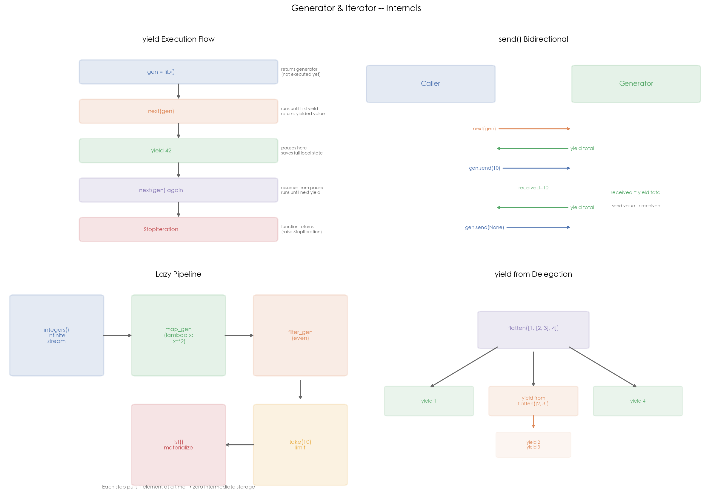

# 04 · 生成器与迭代器：yield 的暂停/恢复与惰性求值

## 1. 引言

迭代器是 Python 中"遍历"的底层协议，生成器则是实现迭代器最简洁的方式——只要函数中包含 `yield` 关键字，它就不再是普通函数，而是生成器函数。调用它不会执行任何代码，而是返回一个生成器对象，每次 `next()` 时执行到下一个 `yield` 暂停。

生成器的核心价值是**惰性求值**（lazy evaluation）：不提前计算所有值，而是按需生成。这使得它可以处理无限序列（如斐波那契数列）、构建零内存管道（如日志处理链），并且是 Python 协程（async/await 之前）的基础。

## 2. 文件结构

```
04_generator_iterator/
├── README.md                 # 本教程文档
├── generator_iterator.py     # 主演示脚本：yield / send / yield from / 惰性管道
├── scripts/
│   └── gen_diagram.py # 示意图生成脚本（四面板机制图）
└── images/
    └── generator_iterator.png  # 四面板可视化（由 gen_diagram.py 生成）
```

主脚本内容：

```
generator_iterator.py
├── 1. RangeIterator / range_generator  # 手写迭代器 vs 生成器
├── 2. fibonacci()                       # yield 基础：惰性斐波那契
├── 3. accumulator() / moving_average()  # send() 双向通信
├── 4. flatten() / chain()               # yield from 委托
├── 5. integers() / take() / filter_gen() / map_gen()  # 惰性管道
├── 6. demo_memory()                     # 生成器 vs 列表内存对比
└── 7. pipeline_demo()                   # 日志处理实战管道
```

## 3. 核心概念

### 3.1 迭代器协议

```python
class MyIterator:
    def __iter__(self):
        return self

    def __next__(self):
        if self.done:
            raise StopIteration
        value = ...
        return value
```

`for` 循环的底层就是不断调用 `__next__()` 直到 `StopIteration`。生成器自动实现了 `__iter__`（返回自身）和 `__next__`（恢复执行到下一个 yield），5 行 yield 代码等价 20+ 行手写迭代器。

### 3.2 yield 的暂停/恢复机制

```python
def fib():
    a, b = 0, 1
    while True:
        yield a    # ← 暂停，保存所有局部变量
        a, b = b, a + b

gen = fib()       # 不执行任何代码，返回生成器对象
next(gen)          # → 0（执行到 yield a，暂停）
next(gen)          # → 1（从暂停处恢复，执行到下一个 yield）
```

每次 `yield` 暂停时，Python 保存完整的函数栈帧（局部变量、指令指针、异常状态）。下次 `next()` 时从暂停处精确恢复——不需要额外的实例变量来保存状态。

### 3.3 send() — 双向通信

```python
def accumulator():
    total = 0
    while True:
        received = yield total   # yield 返回 total，send 的值赋给 received
        total += received
```

**执行流程**：
1. `next(gen)` — 首次必须先"启动"（priming）生成器，执行到 `yield total`（`gen.send(None)` 等价于 `next(gen)`；但 `send(非 None)` 在启动前会报 TypeError）
2. `gen.send(10)` — 将 10 赋给 `received`，恢复执行，计算新 total，到下一个 `yield` 暂停并返回

`send()` 是 Python 协程的早期实现方式（生成器协程）。`async/await`（3.5+）概念上沿用了这一暂停/恢复机制，但已是原生协程，不再基于生成器实现。

### 3.4 yield from — 委托子生成器

```python
def flatten(items):
    for item in items:
        if isinstance(item, list):
            yield from flatten(item)  # 委托给子生成器
        else:
            yield item
```

`yield from` 做了三件事：
1. **值的透传**：子生成器 yield 的值直接透传给调用方
2. **异常的透传**：send() / throw() / close() 直接传递给子生成器
3. **返回值的捕获**：子生成器 `return` 的值成为 `yield from` 表达式的值（通过 `StopIteration.value` 传递——[3] 中 accumulator 的返回值就是这样拿到的）

### 3.5 惰性管道

```python
result = list(take(10,
    filter_gen(lambda x: x % 2 == 0,
        map_gen(lambda x: x**2,
            integers()))))
```

管道中每个环节都是生成器，每次只处理一个元素。即使 `integers()` 是无限流，整个管道的内存开销也是 O(1)。

| 模式 | 列表推导 `[f(x) for x in data]` | 生成器管道 |
|:---|:---|:---|
| 内存 | O(n)，全部存储 | O(1)，逐个处理 |
| 何时计算 | 立即全部计算 | 按需逐个计算 |
| 无限流 | 不支持 | 支持 |
| 适合 | 需要多次遍历 | 单次遍历（for/list/sum） |

### 3.6 高频追问

**Q1: yield 和 return 的区别？**

| 维度 | yield | return |
|:---|:---|:---|
| 函数类型 | 生成器函数 | 普通函数 |
| 多次返回 | 可以（每次 yield 一个值） | 只能一次 |
| 状态 | 暂停/恢复，保存完整栈帧 | 结束，释放栈帧 |
| 返回值 | `StopIteration.value`（通过 return） | 直接返回 |

**Q2: 生成器只能遍历一次？**

是的。生成器是**单向迭代器**，耗尽后无法重置：

```python
gen = fibonacci(5)
list(gen)  # [0, 1, 1, 2, 3]
list(gen)  # []  (已耗尽)
```

**Q3: 生成器表达式的适用场景？**

当只需要**单次遍历**时用生成器表达式（如 `sum(x**2 for x in range(1000000))`）；需要**多次遍历或索引访问**时用列表推导。

**Q4: 生成器和协程的关系？**

Python 的协程经历了三代演进：生成器协程（`yield` + `send()`）→ `@coroutine` + `yield from` → `async/await`。三代都建立在"暂停/恢复"这一机制之上；3.5+ 的 `await` 语义上可类比为 `yield from` 的异步版本，但已是原生协程对象。

## 4. 实操演示

```bash
cd interview/04_generator_iterator
python3 generator_iterator.py     # 运行全部 demo（send/yield from/惰性管道/内存对比）
python3 scripts/gen_diagram.py # 重新生成 images/generator_iterator.png
```

真实输出示例（macOS, CPython 3.10，节选）：

```
[3] send() — bidirectional generator:
  accumulator:
    send(10) -> total=10
    send(20) -> total=30
    send(30) -> total=60
    StopIteration: processed 3 values
  moving_average:
    send(10) -> avg=10.0
    send(20) -> avg=15.0
    send(30) -> avg=20.0

[4] yield from — delegation:
  flatten([1, [2, 3, [4, 5]], 6, [7, 8, 9]]) = [1, 2, 3, 4, 5, 6, 7, 8, 9]
  chain(range(3), range(5)) = [0, 1, 2, 0, 1, 2, 3, 4]

[5] Lazy pipeline (infinite stream):
  First 10 even squares: [0, 4, 16, 36, 64, 100, 144, 196, 256, 324]

[6] Generator vs List — memory:
  List comprehension:  ~3,516 KB
  Generator expression: 104 bytes
  Ratio: ~34,621x smaller

[7] Log processing pipeline:
  Lazy pipeline: log_lines → parse → filter_errors → take(5)
    [2024-01-03 10:02:02] connection timeout
    [2024-01-06 10:05:05] db query slow
    [2024-01-09 10:08:08] cache miss
    ...

[8] Generator state inspection:
  type: generator
  gi_running: False
  gi_frame: True
  after next(): gi_frame=True
  after exhaust: gi_frame=None
```

## 5. 预期结果与陷阱



上图 2x2 布局展示生成器的核心机制：
- **左上 — yield Execution Flow**：从 `gen = fib()` 创建生成器（不执行），到 `next(gen)` 推进到第一个 yield 暂停，再到继续 `next()` 恢复执行，最终函数结束抛出 `StopIteration`
- **右上 — send() Bidirectional**：调用方和生成器之间的双向数据流。`next(gen)` / `gen.send(value)` 向生成器发送数据，`yield expr` 向调用方返回数据
- **左下 — Lazy Pipeline**：惰性管道的链式结构。`integers()` → `map_gen(x**2)` → `filter_gen(even)` → `take(10)` → `list()`，每个环节每次只拉取一个元素，零中间存储
- **右下 — yield from Delegation**：`flatten([1, [2, 3], 4])` 的递归委托过程。外层生成器遇到子列表时通过 `yield from` 委托给递归的子生成器

诚实预期（本机实测）：

- **内存对比的数值随 Python 版本变化**：demo 用 `sys.getsizeof` 估算，CPython 3.10 下生成器表达式为 104 bytes，列表约 3.4 MB（~34000x）。不同版本/平台的 getsizeof 结果会不同，但"数量级差距"这个结论稳定
- 列表内存是**估算值**（抽样前 1000 个 int 的大小外推），不是精确统计
- `[7] Log processing pipeline` 的 5 条 ERROR 输出内容每次运行不同（日志级别随机），但**条数稳定为 5**——整个管道是惰性的：生成、解析、过滤、截断每个环节每次只处理一个元素，直到 `take(5)` 取满为止

## 6. 小结

1. **生成器自动实现迭代器协议**，无需手写 `__iter__`/`__next__`
2. **yield 暂停并保存完整栈帧**，next() 精确恢复
3. **send() 实现双向通信**，是 Python 协程的基础
4. **yield from 委托子生成器**，透传值/异常/close
5. **惰性管道 O(1) 内存**，适合单次遍历和无限流

下一篇进入 05_metaclass：看元类如何在类创建之前拦截和改写类的行为。
