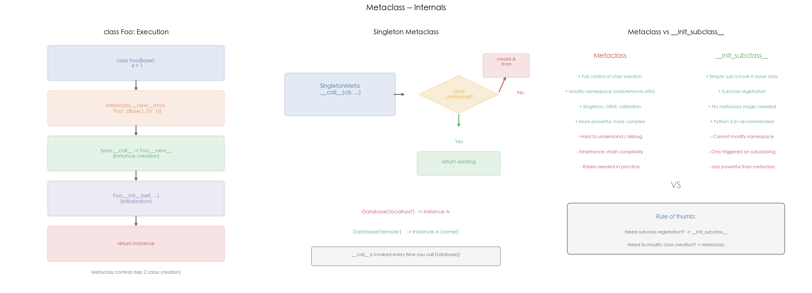

# 05 · 元类：在类创建之前拦截类型定义的"类的类"

## 1. 引言

元类是"类的类"——`type` 是所有类的默认元类。当你写 `class Foo:` 时，Python 实际上调用 `type("Foo", bases, namespace)` 来创建类。自定义元类可以拦截这一过程，在类创建时自动修改属性、注册子类、实现 ORM 字段映射。

`__init_subclass__`（Python 3.6+）是元类的轻量替代——当你只需要子类注册或校验时，不需要元类那么重的机制。

## 2. 文件结构

```
05_metaclass/
├── README.md              # 本教程文档
├── metaclass.py           # 主演示脚本：type() 创建类 / 单例 / ORM / 子类注册
├── scripts/
│   └── gen_diagram.py # 示意图生成脚本（三面板机制图）
└── images/
    └── metaclass.png      # 三面板可视化（由 gen_diagram.py 生成）
```

主脚本内容：

```
metaclass.py
├── 1. demo_type_creation()        # type() 手动创建类
├── 2. AddStrMeta                  # 元类：自动添加 __str__
├── 3. SingletonMeta               # 元类：单例模式
├── 4. OrmMeta + Model             # 元类：ORM 字段映射
└── 5. EventRegistry               # __init_subclass__：子类注册
```

## 3. 核心概念

### 3.1 type() 创建类

```python
# 等价于 class Dog(Animal): species = "Canine"
Dog = type("Dog", (Animal,), {"species": "Canine"})
```

`class` 语句本质上是 `type()` 的语法糖。

### 3.2 元类实战模式

**单例模式**

```python
class SingletonMeta(type):
    _instances = {}
    def __call__(cls, *args, **kwargs):
        if cls not in cls._instances:
            cls._instances[cls] = super().__call__(*args, **kwargs)
        return cls._instances[cls]
```

元类的 `__call__` 在 `ClassName()` 时触发，控制实例的创建和返回。

**ORM 字段映射**

```python
class OrmMeta(type):
    def __new__(mcs, name, bases, namespace):
        cls = super().__new__(mcs, name, bases, namespace)
        cls._fields = {k: v for k, v in namespace.items() if isinstance(v, Field)}
        cls._table = name.lower()
        return cls
```

元类在类创建时扫描所有 `Field` 实例，自动构建表结构信息。

### 3.3 `__init_subclass__` vs 元类

| 需求 | 推荐 |
|:---|:---|
| 子类注册/校验 | `__init_subclass__` |
| 修改类命名空间 | 元类 |
| 单例/ORM | 元类 |
| 简单钩子 | `__init_subclass__` |

**原则：能用 `__init_subclass__` 就不用元类。**

### 3.4 高频追问

**Q1: `__new__` vs `__init__` vs 元类的 `__new__`？**

- `__new__`: 创建**实例**（对象）
- `__init__`: 初始化**实例**
- 元类的 `__new__`: 创建**类**本身

**Q2: type 是什么？**

`type` 是所有类的默认元类，也是自身的实例：

```python
type(int)           # <class 'type'>
type(type)          # <class 'type'>
isinstance(int, type)  # True
```

## 4. 实操演示

```bash
cd interview/05_metaclass
python3 metaclass.py          # 运行全部 demo（type/单例/ORM/子类注册）
python3 scripts/gen_diagram.py # 重新生成 images/metaclass.png
```

真实输出示例（macOS, CPython 3.10，节选）：

```
[1] type() class creation:
  1) type() creates a class:
    Dog.kingdom  = Animalia
    Dog.species = Canine
    type(Dog)    = type
    type(type)  = type

[2] AddStrMeta (auto __str__):
  Person({'name': 'Alice', 'age': 30})
  custom str  (has custom __str__, metaclass skipped)

[3] SingletonMeta:
  db1 is db2: True
  db1.host: localhost  (first creation wins)
  db1.query('SELECT 1'): [localhost] executing: SELECT 1

[4] Simple ORM (metaclass field mapping):
  User._table: user
  User._fields: ['id', 'name', 'email']
  CREATE: CREATE TABLE user (id int PRIMARY KEY, name str, email str)
  SELECT: SELECT id, name, email FROM user
  INSERT: INSERT INTO user (id, name, email) VALUES (1, 'Alice', 'alice@example.com')

[5] __init_subclass__ (no metaclass needed):
  Registered handlers: ['click', 'key']
  click handler: handling click
  All subclasses: ['ClickEvent', 'KeyEvent']

[6] Type hierarchy:
  int is instance of type: True
  type is instance of type: True
  type(42): int
  type(int): type
  type(type): type
```

## 5. 预期结果与陷阱



上图三面板展示元类的核心机制：
- **左图 — class 创建流程**：`class Foo(Base):` 触发 `type.__call__` → 元类 `__new__`（创建类）→ 逐个调用 `__set_name__` → 父类的 `__init_subclass__`（本 lab 的 `Field` 与 `EventRegistry` 就挂在这两个钩子上）→ 元类 `__init__`。之后 `Foo()` 才触发实例的 `__new__` → `__init__`。元类控制的是"类创建"这一步
- **中图 — 单例模式**：`SingletonMeta.__call__` 在每次 `Database()` 时检查是否已有实例，有则返回已有实例
- **右图 — 元类 vs `__init_subclass__`**：两者的优缺点对比和选择建议

诚实预期（本机实测）：

- 全部 demo 行为都是**确定性的**（单例 `db1 is db2: True`、ORM 生成的 SQL、子类注册列表每次运行一致）
- demo 的"ORM"只生成 SQL 字符串，**没有真实数据库连接**——元类字段映射的拦截效果可见，但执行层面不可验证
- 单例演示里第二次 `Database("remotehost")` 的参数被忽略（首次创建胜出），这是单例模式的预期陷阱而非 bug

## 6. 小结

1. **元类是"类的类"**，`type` 是默认元类
2. **`__call__` 控制实例创建**（单例模式）
3. **`__new__` 控制类创建**（ORM 字段映射）
4. **`__init_subclass__` 是元类的轻量替代**，适合子类注册

下一篇进入 06_slots_memory：看 `__slots__` 如何用固定属性数组替代实例字典、省下内存。
