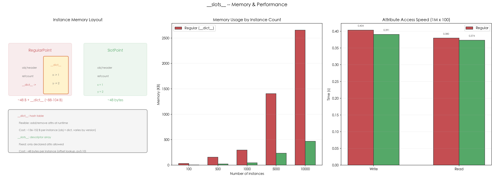

# 06 · `__slots__` 与内存优化：用固定属性数组替代实例字典

## 1. 引言

Python 默认用 `__dict__`（哈希表）存储实例属性，两属性对象每个实例约 136~152 bytes（对象本体 48 B + 实例字典，随版本浮动）。`__slots__` 声明固定属性集合后，Python 改用描述符数组存储，每个实例降到约 48 bytes，万级实例总内存节省 60%~70%。同时禁用动态属性添加。历史上（约 3.10 及以前）属性访问也有 10%~40% 提速，但 3.11+ 的属性访问优化后两者已基本持平——**今天用 slots 的主要理由是内存，不是速度**。

适合创建大量轻量对象（如坐标点、配置项、ORM 模型）的场景。

## 2. 文件结构

```
06_slots_memory/
├── README.md            # 本教程文档
├── slots_memory.py      # 主演示脚本：内存对比 / 继承 / weakref / 速度基准
├── scripts/
│   └── gen_diagram.py # 示意图生成脚本（含真实内存与速度测量数据）
└── images/
    └── slots_memory.png # 三面板可视化（由 gen_diagram.py 生成）
```

主脚本内容：

```
slots_memory.py
├── 1. RegularPoint / SlotPoint        # 基础对比
├── 2. SlotWithDefault                  # 默认值来自 __init__ 形参（slots 本身无默认值）
├── 3. Slot3D / NoSlotChild            # 继承中的 slots
├── 4. SlotWithWeakref                  # weakref 支持
└── 5. benchmark_access()               # 访问速度基准测试
```

## 3. 核心概念

### 3.1 内存原理

```
RegularPoint (no slots):
  obj_header + __dict__ pointer + __dict__ hash table
  ~136-152 bytes per instance (48 B 对象本体 + 实例字典, 随版本浮动)

SlotPoint (with __slots__):
  obj_header + fixed-size array [x, y]
  ~48 bytes per instance (CPython 3.10/3.13 实测)
```

`__dict__` 是哈希表（动态、灵活、开销大），`__slots__` 是描述符数组（固定、紧凑、开销小）。

### 3.2 注意事项

| 规则 | 说明 |
|:---|:---|
| 子类与 slots | 父类的 slots 仍生效；子类若不声明自己的 `__slots__`，会**额外**获得 `__dict__` |
| 禁止动态属性 | `obj.z = 3` 抛出 `AttributeError` |
| 需要 `__weakref__` | 想支持 `weakref.ref()` 必须在 slots 中声明 |
| 属性描述符 | `SlotPoint.x` 是描述符（member_descriptor） |
| 默认值 | `__slots__ = ("x",)` 中 x 不自动设默认值 |

### 3.3 高频追问

**Q1: 什么时候应该用 `__slots__`？**

- 需要创建大量（成千上万）轻量对象时
- 对象属性固定、不需要动态添加属性时
- 内存敏感的场景（缓存、游戏实体）

**Q2: `__slots__` 会影响 pickle 序列化吗？**

不会。`pickle` 能正确处理 `__slots__` 对象。但 `__getstate__`/`__setstate__` 行为略有不同。

## 4. 实操演示

```bash
cd interview/06_slots_memory
python3 slots_memory.py          # 运行全部 demo
python3 scripts/gen_diagram.py # 重新生成 images/slots_memory.png
```

真实输出示例（macOS, CPython 3.10，节选）：

```
[2] Bulk memory (10,000 instances):
  Regular: 1484.4 KB total
  Slotted: 468.8 KB total
  Savings: 68.4%

[3] __slots__ blocks dynamic attributes:
  SlotPoint: can add .z?
    AttributeError: 'SlotPoint' object has no attribute 'z'

[5] weakref support:
  SlotPoint: TypeError: cannot create weak reference to 'SlotPoint' object

[6] Attribute access speed (1M iterations x 100 objects):
  regular_write: 1.3969s
  slot_write: 1.0488s
  Write speedup: 1.33x
  Read speedup:  1.15x
```

## 5. 预期结果与陷阱



上图三面板展示 `__slots__` 的效果：
- **左图 — 实例内存布局**：`RegularPoint` 使用 `__dict__` 哈希表（对象本体 48 B + 实例字典 ~88-104 B），`SlotPoint` 使用固定数组（~48 bytes，CPython 3.10/3.13 实测）
- **中图 — 大规模内存对比**：随实例数量增长，slots 的内存优势愈发明显（10000 实例节省 ~65%）
- **右图 — 属性访问速度**：使用真实基准数据。3.10 及以前 slots 的描述符访问普遍快于 `__dict__` 查找；3.11+ 属性访问优化后两者基本持平——速度比值随版本与负载浮动，看量级即可

诚实预期（本机实测）：

- **内存节省稳定可复现**，但百分比随版本浮动：10000 实例节省 64%~68%（3.10 实测 68.4%，3.13 实测 64.7%——两版实例字典大小不同所致）。单个对象的 `sys.getsizeof` 只算对象本体——本机 3.10 中 `RegularPoint` 与 `SlotPoint` 的 getsizeof 同为 48 bytes，差异全部来自 `__dict__`（需把 `getsizeof(p.__dict__)` 加上才看得到），这是 `getsizeof` 只计浅层大小的预期陷阱
- **速度比值随版本差异巨大**：本机 3.10 实测 write 1.38x / read 1.08x，3.13 实测 write 0.97x / read 1.04x——3.11+ 的属性访问优化让 slots 的速度优势基本消失，个别运行甚至持平或反超。"slots 快 20-30%" 是旧版本的经验值，别当成普适结论
- `[3]` 的 `AttributeError` 文案随版本变化：3.10 为 `'SlotPoint' object has no attribute 'z'`；3.11+ 追加后缀 ` and no __dict__ for setting new attributes`
- `weakref.ref(SlotPoint(...))` 抛 `TypeError` 是预期行为，除非 slots 中声明了 `__weakref__`

## 6. 小结

1. **`__slots__` 用描述符数组替代 `__dict__`**，万级实例总内存节省 60%~70%
2. **禁用动态属性**，属性必须在 slots 中声明
3. **父类的 slots 仍生效**，但子类不声明自己的 `__slots__` 就会额外获得 `__dict__`
4. **属性访问不慢于普通属性**（3.10 及以前更快，3.11+ 基本持平）——别把速度当作用 slots 的主要理由
5. **需要 `__weakref__` 才支持弱引用**

下一篇进入 07_mro_mixin：看多继承下 C3 线性化如何决定 `super()` 的去向。
