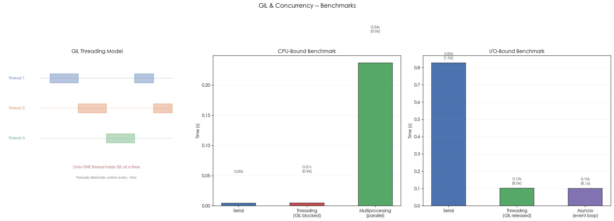

# 08 · GIL 与并发模型：为什么多线程不能利用多核

## 1. 引言

GIL（Global Interpreter Lock）是 CPython 的全局解释器锁，同一时刻只允许一个线程执行 Python 字节码。这使得 Python 的 `threading` 在 CPU 密集型任务中无法利用多核。三种并发模型各有适用场景：`threading`（I/O 密集）、`multiprocessing`（CPU 密集）、`asyncio`（大量 I/O 并发）。

## 2. 文件结构

```
08_gil_concurrency/
├── README.md              # 本教程文档
├── gil_concurrency.py     # 主演示脚本：基准测试 + GIL 释放场景 + 选型指南
├── scripts/
│   └── gen_diagram.py # 示意图生成脚本（含真实基准数据柱状图）
└── images/
    └── gil_concurrency.png  # 三面板可视化（由 gen_diagram.py 生成）
```

主脚本内容：

```
gil_concurrency.py
├── 1. cpu_heavy()          # CPU 密集任务（素数计数）
├── 2. io_heavy()           # I/O 密集任务（模拟 sleep）
├── 3. bench_cpu()          # 串行 / threading / multiprocessing 对比
└── 4. bench_io()           # 串行 / threading / asyncio 对比
```

## 3. 核心概念

### 3.1 GIL 的工作方式

```
Thread 1: [====GIL====]          [==GIL==]
Thread 2:              [==GIL==]          [==GIL==]
Thread 3:                        [==GIL==]
```

每个 ~5ms 切换一次（`sys.getswitchinterval()`）。在 I/O 操作时自动释放 GIL。

### 3.2 三种并发模型对比

| 模型 | 适用场景 | GIL 影响 | 内存开销 |
|:---|:---|:---|:---|
| **threading** | I/O 密集（网络/文件/DB） | GIL 在 I/O 时释放 | 低（共享内存） |
| **multiprocessing** | CPU 密集（计算/编码） | 每进程独立 GIL | 高（进程隔离） |
| **asyncio** | 大量 I/O 并发（高 QPS API） | 单线程，无 GIL 问题 | 最低 |

### 3.3 何时释放 GIL

| 操作 | GIL 释放 | 原因 |
|:---|:---|:---|
| `time.sleep()` | Yes | I/O 等待 |
| `socket.recv()` | Yes | 网络 I/O |
| `numpy.sum()` | Yes | C 扩展 |
| `for x in range(1e9)` | No | 纯 Python |
| `str.join()` | No | 纯 Python |

C 扩展（numpy、re、json）可以在 C 层释放 GIL，实现真正的并行。

### 3.4 高频追问

**Q1: 为什么不直接去掉 GIL？**

GIL 保护 CPython 的引用计数内存管理。去掉 GIL 需要改为更复杂的垃圾回收机制，会降低单线程性能。Python 3.13 实验了 `--disable-gil`（free-threading），但尚不成熟。

**Q2: asyncio 和 threading 怎么选？**

- 少量 I/O（< 100 并发）→ threading（简单）
- 大量 I/O（> 100 并发）→ asyncio（高效）
- CPU 密集部分用 `run_in_executor()` 转给进程池

## 4. 实操演示

```bash
cd interview/08_gil_concurrency
python3 gil_concurrency.py          # 运行全部基准测试 demo
python3 scripts/gen_diagram.py # 重新生成 images/gil_concurrency.png
```

真实输出示例（macOS, CPython 3.10, 18 核）：

```
[1] GIL info:
  Python: 3.10.20
  Implementation: cpython
  Switch interval: 5ms

[2] CPU-bound (prime counting, 5000, 4 workers):
                serial: 0.005s
             threading: 0.005s
       multiprocessing: 0.048s
  → Threading SLOWER (GIL contention)
  → Multiprocessing FASTER (parallel execution)

[3] I/O-bound (8 x 100ms sleep):
                serial: 0.830s
             threading: 0.105s
               asyncio: 0.102s
  → Both FASTER (GIL released during I/O)
```

## 5. 预期结果与陷阱



上图三面板展示并发模型的核心机制和基准测试结果：

- **左图 — GIL 工作模型**：同一时刻只有一个线程持有 GIL，线程交替执行。每个线程持有 GIL 约 5ms 后释放
- **中图 — CPU 密集基准测试**：threading 因 GIL 争用不会比串行更快；multiprocessing 能真正并行
- **右图 — I/O 密集基准测试**：threading 和 asyncio 都接近理论最优（8x 加速），因为 GIL 在 I/O 等待时自动释放

诚实预期（本机实测）：

- **I/O 密集加速稳定可复现**：8 × 100ms sleep 的串行耗时 ~0.83s，threading/asyncio 都 ~0.10s，接近 8x 理论上限
- **CPU 密集的默认规模太小，看不到 multiprocessing 优势**：demo 用 n=5000 时串行只要 ~5ms，进程池的启动/序列化开销（~48ms）反而让它显得更慢 —— 这不是故障，是任务粒度小于进程通信成本的预期行为。把 `bench_cpu(n=200000)` 调大后才能看到 multiprocessing 的并行加速
- threading 在 CPU 密集下约等于串行（1.0x 上下浮动），小幅波动来自 GIL 切换的时机，不是加速

## 6. 小结

1. **GIL 限制多线程 CPU 并行**，但不影响 I/O 并发
2. **CPU 密集用 multiprocessing**，I/O 密集用 threading/asyncio
3. **C 扩展可以释放 GIL**（numpy、re 等）
4. **asyncio 是单线程事件循环**，用协程实现并发

下一篇进入 09_magic_methods：看 `__repr__` / `__add__` 等魔术方法如何让自定义类获得内建行为。
