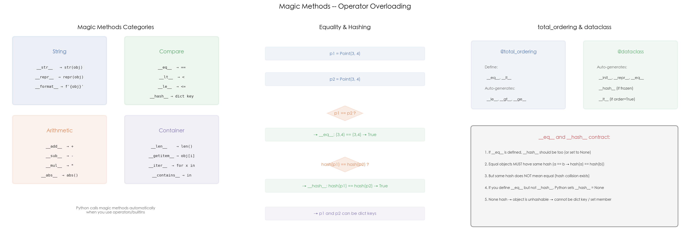

# 09 · 魔术方法：`__eq__` / `__hash__` / `__repr__` 与运算符重载

## 1. 引言

Python 的运算符和内置函数背后都是魔术方法（dunder methods）。`a + b` 调用 `a.__add__(b)`，`len(obj)` 调用 `obj.__len__()`，`str(obj)` 调用 `obj.__str__()`。理解魔术方法可以自定义类的行为，配合 `@total_ordering` 和 `@dataclass` 大幅减少样板代码。

## 2. 文件结构

```
09_magic_methods/
├── README.md           # 本教程文档
├── magic_methods.py    # 主演示脚本：repr/str、eq/hash、运算符、容器协议
├── scripts/
│   └── gen_diagram.py # 示意图生成脚本（三面板机制图）
└── images/
    └── magic_methods.png  # 三面板可视化（由 gen_diagram.py 生成）
```

主脚本内容：

```
magic_methods.py
├── 1. Point                              # 完整魔术方法（repr/str/eq/hash/add/mul/abs/bool）
├── 2. Version + @total_ordering           # 自动比较运算
├── 3. DCPoint + @dataclass                # 自动生成魔术方法
└── 4. RingBuffer                          # 自定义容器（len/getitem/iter）
```

## 3. 核心概念

### 3.1 `__repr__` vs `__str__`

```python
def __repr__(self):
    """Debug: unambiguous, should eval back"""
    return f"Point({self.x!r}, {self.y!r})"

def __str__(self):
    """Display: human-readable"""
    return f"({self.x}, {self.y})"
```

- `repr(obj)` / `obj.__repr__()` — 开发者调试用，应无歧义
- `str(obj)` / `obj.__str__()` — 用户显示用，应可读
- 没有 `__str__` 时，Python 回退到 `__repr__`

### 3.2 `__eq__` 和 `__hash__` 契约

```
a == b  →  hash(a) == hash(b)    # 必须满足
hash(a) == hash(b)  ⊭  a == b    # 允许哈希碰撞
```

定义了 `__eq__` 但没有定义 `__hash__` 时，Python 自动设 `__hash__ = None`，对象变为不可哈希（不能做 dict key）。

### 3.3 `@total_ordering` 与 `@dataclass`

```python
# 只需定义 __eq__ + __lt__
@total_ordering
class Version:
    def __eq__(self, other): ...
    def __lt__(self, other): ...
    # 自动生成: __le__, __gt__, __ge__（__ne__ 默认由 __eq__ 派生，不靠该装饰器）

# 自动生成 __init__, __repr__, __eq__
# order=True 再加 __lt__/__le__/__gt__/__ge__ 全套; frozen=True 保留 __hash__
@dataclass(order=True, frozen=True)
class Point:
    x: float
    y: float
```

### 3.4 高频追问

**Q1: `NotImplemented` 和 `NotImplementedError` 的区别？**

- `NotImplemented`：魔术方法返回值，表示"不支持这个操作"，Python 会尝试交换操作数
- `NotImplementedError`：异常，表示"子类必须实现"

**Q2: `dataclass` 能替代普通类吗？**

大多数场景可以。但 `dataclass` 不适合需要复杂 `__init__` 逻辑或非标准属性管理的场景。

## 4. 实操演示

```bash
cd interview/09_magic_methods
python3 magic_methods.py          # 运行全部 demo
python3 scripts/gen_diagram.py # 重新生成 images/magic_methods.png
```

真实输出示例（macOS, CPython 3.10，节选）：

```
[1] __repr__ vs __str__:
  repr(p): Point(3, 4)
  str(p):  (3, 4)

[2] __eq__ and __hash__:
  p1 == p2: True
  hash(p1) == hash(p2): True
  d[p2]:  origin  (p2 has same hash, found via __eq__)

[3] Operator overloading:
  Point(3, 4) + Point(1, 2) = (4, 6)
  abs(Point(3, 4)) = 5.0

[6] Custom container (RingBuffer):
  append(3): RingBuffer([3, 1, 2], cap=3)
```

## 5. 预期结果与陷阱



上图三面板展示魔术方法的分类和使用：
- **左图 — 魔术方法分类**：字符串（`__str__`/`__repr__`）、比较（`__eq__`/`__hash__`）、算术（`__add__`/`__mul__`）、容器（`__len__`/`__getitem__`）
- **中图 — 相等与哈希**：`p1 == p2` 调用 `__eq__`，`hash(p1) == hash(p2)` 调用 `__hash__`，两者配合使对象可做 dict key
- **右图 — `@total_ordering` 与 `@dataclass`**：两种减少样板代码的装饰器对比，以及 `__eq__`/`__hash__` 契约的 5 条规则

诚实预期（本机实测）：

- 本 demo 的哈希全部基于**数值元组**（`hash((self.x, self.y))` 等）——数值类型的哈希不受 `PYTHONHASHSEED` 影响，具体数值**跨运行也稳定**；str/bytes 哈希与默认对象 id 哈希才会因加盐随机化而每次运行不同。其余输出全部确定性可复现
- `Point(3, 4) + "hello"` 抛 `TypeError` 是 `__add__` 返回 `NotImplemented` 后两个操作数都试过的结果，不是异常直接抛出——这是协议回退机制
- 陷阱：只定义 `__eq__` 不定义 `__hash__` 的类会静默失去可哈希性（`__hash__ = None`），`d[obj]` 直接 `TypeError`，本 demo 的 `Point`/`Version` 因此都配套实现了 `__hash__`

## 6. 小结

1. **`__repr__` 用于调试，`__str__` 用于显示**，没有 `__str__` 回退到 `__repr__`
2. **`__eq__` 和 `__hash__` 必须配套**，否则对象不可哈希
3. **`@total_ordering` 只需 `__eq__` + `__lt__`**，自动生成其他比较方法
4. **`@dataclass` 自动生成 `__init__`/`__repr__`/`__eq__`/`__hash__`**

下一篇进入 10_abc_duck_typing：看 ABC、Duck Typing 与 Protocol 三种多态路线怎么选。
