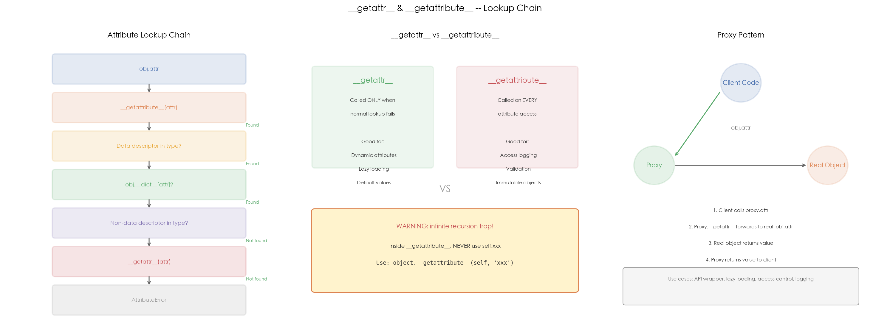

# 11 · `__getattr__` 与 `__getattribute__`：属性访问控制与动态代理

## 1. 引言

Python 的属性访问背后有一条完整的查找链：`__getattribute__` -> 数据描述符 -> 实例 `__dict__` -> 非数据描述符 -> `__getattr__`。`__getattribute__` 在**每次**属性访问时都触发，而 `__getattr__` 仅在常规查找**失败后**才触发。理解两者的区别和触发时机，是实现动态属性、懒加载、代理模式等高级模式的基础，也是 Python 面试中的高频考点。

## 2. 文件结构

```
11_getattr_proxy/
├── README.md              # 本教程文档
├── getattr_proxy.py       # 主演示脚本：动态属性 / 访问日志 / 代理 / 懒加载
├── scripts/
│   └── gen_diagram.py # 示意图生成脚本（三面板机制示意图）
└── images/
    └── getattr_proxy.png  # 三面板可视化（由 gen_diagram.py 生成）
```

主脚本内容：

```
getattr_proxy.py
├── 1. DynamicAttributes   # __getattr__: 访问不存在属性时动态查找
├── 2. AccessLogger        # __getattribute__: 记录所有属性读写
├── 3. Proxy               # 代理模式: 属性转发到内部对象
├── 4. LazyConfig          # 懒加载: 首次访问时触发加载
└── 5. run_demo()          # 交互式演示
```

## 3. 核心概念

### 3.1 `__getattr__` — 属性不存在时触发

```python
class DynamicAttributes:
    def __init__(self, data):
        self._data = data

    def __getattr__(self, name):
        """仅在常规查找失败时调用"""
        if name in self._data:
            return self._data[name]
        raise AttributeError(f"'{type(self).__name__}' has no attribute '{name}'")
```

- `obj.name` 先走常规查找（`__getattribute__` -> `obj.__dict__`），找不到才调 `__getattr__`
- 适合场景：**动态属性**、**默认值**、**向后兼容的重命名属性**

### 3.2 `__getattribute__` — 每次访问都触发

```python
class AccessLogger:
    def __getattribute__(self, name):
        log = object.__getattribute__(self, '_log')   # 必须用 object.__getattribute__
        if name.startswith('_'):
            return object.__getattribute__(self, name)
        log.append(("get", name))
        # ...
```

- **每个**属性访问都会进入 `__getattribute__`，包括已存在的属性
- 必须用 `object.__getattribute__(self, name)` 访问自身属性，否则**无限递归**
- 适合场景：**访问日志**、**权限校验**、**不可变对象**

### 3.3 代理模式（Proxy）

```python
class Proxy:
    def __init__(self, obj):
        object.__setattr__(self, '_obj', obj)  # 避免触发自定义 __setattr__

    def __getattr__(self, name):
        return getattr(self._obj, name)         # 转发到被代理对象

    def __setattr__(self, name, value):
        if name == '_obj':
            object.__setattr__(self, name, value)
        else:
            setattr(self._obj, name, value)
```

- 代理模式的核心：`__getattr__` 将属性访问**透明转发**到内部对象
- 客户端代码只和 Proxy 交互，完全不知道真实对象的存在
- 典型用途：**API wrapper**、**远程调用**、**懒初始化**、**访问控制**

### 3.4 懒加载

```python
class LazyConfig:
    def __getattr__(self, name):
        if not object.__getattribute__(self, '_loaded'):
            self.load()                           # 首次访问时才加载
        cache = object.__getattribute__(self, '_cache')
        if name in cache:
            return cache[name]
        raise AttributeError(f"'{name}' not in config")
```

- 配置/资源在首次访问时才加载，避免启动时的开销
- `__getattr__` 是实现懒加载最自然的方式：属性不存在 -> 触发加载 -> 返回值

### 3.5 高频追问

**Q1: `__getattr__` 和 `__getattribute__` 的区别？**

| | `__getattr__` | `__getattribute__` |
|---|---|---|
| 触发时机 | 常规查找**失败后** | **每次**属性访问 |
| 默认实现 | 抛出 `AttributeError` | 从 `__dict__` 等常规路径查找 |
| 自定义频率 | 高（安全） | 低（容易递归） |

**Q2: 为什么 `__getattribute__` 中不能用 `self.xxx`？**

`self.xxx` 本身就是属性访问，会再次调用 `__getattribute__`，导致无限递归。必须用 `object.__getattribute__(self, 'xxx')` 绕过自定义逻辑。

同理，`__setattr__` 中设置自身属性必须用 `object.__setattr__(self, name, value)`。

**Q3: 代理模式为什么用 `__getattr__` 而不是 `__getattribute__`？**

用 `__getattr__` 更简单安全：Proxy 自身的属性（如 `_obj`）走常规查找，只有不存在的属性才转发到被代理对象。用 `__getattribute__` 需要手动区分"代理自身的属性"和"被代理对象的属性"，代码更复杂且容易出错。

**Q4: 属性描述符在查找链中的位置？**

数据描述符（同时定义 `__get__` + `__set__`/`__delete__`）优先级高于实例 `__dict__`，非数据描述符（只定义 `__get__`）优先级低于实例 `__dict__`。这也是 `property`、`classmethod`、`staticmethod` 的实现原理。

## 4. 实操演示

```bash
cd interview/11_getattr_proxy
python3 getattr_proxy.py          # 运行 demo（无需 matplotlib）
python3 scripts/gen_diagram.py # 重新生成 images/getattr_proxy.png
```

真实输出示例（macOS, CPython 3.10）：

```
[1] __getattr__ (only on missing):
  obj.name = Alice
  obj.age = 30
  obj.email -> AttributeError: 'DynamicAttributes' has no attribute 'email'

[2] __getattribute__ (every access):
  Access log: [('set', 'x'), ('set', 'y'), ('get', 'x'), ('get', 'y'), ('get', 'z'), ('get', 'get_log')]

[3] Proxy (attribute forwarding):
  p.host = api.example.com
  p.connect() = Connected to api.example.com:30
  After proxy setattr: p.timeout = 60, svc.timeout = 60

[4] Lazy loading (__getattr__ triggers load):
  Before access: LazyConfig(loaded=False)
  cfg.host = localhost
  After access: LazyConfig(loaded=True)
```

## 5. 预期结果与陷阱



上图三面板展示了属性访问的完整机制：

- **左图 — 属性查找链**：`obj.attr` -> `__getattribute__` -> 数据描述符 -> `obj.__dict__` -> 非数据描述符 -> `__getattr__` -> `AttributeError`，逐步查找直到找到属性或抛出异常
- **中图 — `__getattr__` vs `__getattribute__`**：前者仅在查找失败时调用（适合动态属性/懒加载），后者每次访问都触发（适合日志/校验），下方警告在 `__getattribute__` 中不能使用 `self.xxx`，必须用 `object.__getattribute__(self, 'xxx')`
- **右图 — 代理模式**：客户端调用 `proxy.attr`，Proxy 的 `__getattr__` 转发到真实对象的属性，适用于 API wrapper、懒加载、访问控制等场景

诚实预期（本机实测）：

- demo 输出是**确定性的**（不涉及计时/并发），每次运行结果一致
- `[2]` 的 Access log 里会出现 `('get', 'get_log')` —— 因为 `logger.get_log()` 本身也是属性访问，被 `__getattribute__` 记录了下来，这正是"每次访问都触发"的证据，不是 bug
- 本 demo 不演示无限递归的实际崩溃（`RecursionError`），只以文字警告形式提示；想验证可自行在 `__getattribute__` 里写 `self._log` 触发

## 6. 小结

1. **`__getattr__` 仅在属性不存在时触发**，适合动态属性、懒加载、默认值
2. **`__getattribute__` 每次访问都触发**，适合日志、校验、不可变对象，但必须用 `object.__getattribute__` 避免递归
3. **代理模式用 `__getattr__` 透明转发**，客户端无需知道真实对象
4. **属性查找链**：`__getattribute__` -> 数据描述符 -> `__dict__` -> 非数据描述符 -> `__getattr__` -> `AttributeError`

下一篇进入 12_new_vs_init：看 `__new__` 与 `__init__` 如何分工完成对象的创建与初始化。
