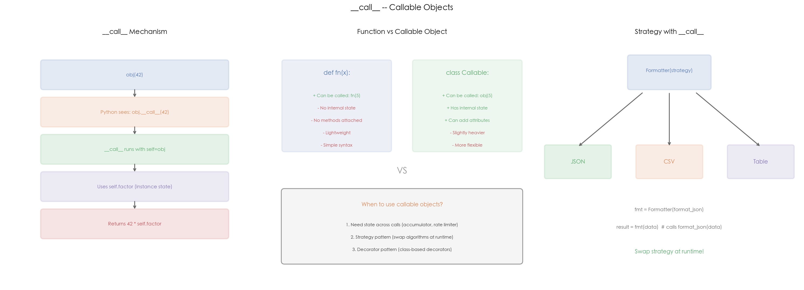

# 13 · `__call__`：可调用对象与函数式模式

## 1. 引言

Python 中一切皆对象，函数也不例外。当你写下 `obj(42)` 时，Python 实际调用的是 `obj.__call__(42)`。只要一个类定义了 `__call__` 方法，它的实例就能像函数一样被调用——这就是**可调用对象（Callable Object）**。

可调用对象是 Python 函数式编程和设计模式的基石：
- **函数对象**：封装状态 + 行为，比普通函数更灵活
- **类装饰器**：`@decorator` 的底层就是返回一个带 `__call__` 的对象
- **策略模式**：用 `__call__` 实现可互换的算法
- **验证器链**：多个可调用对象组合成管道

`callable()` 内置函数可以检查任何对象是否可调用。理解 `__call__` 是理解装饰器、functools、类作为函数替代品的钥匙。

## 2. 文件结构

```
13_callable/
├── README.md              # 本教程文档
├── callable.py            # 主演示脚本：可调用对象 / 策略模式 / 验证器链
├── scripts/
│   └── gen_diagram.py # 示意图生成脚本（三面板机制示意图）
└── images/
    └── callable.png       # 三面板可视化（由 gen_diagram.py 生成）
```

主脚本内容：

```
callable.py
├── 1. Multiplier          # 可调用对象：封装倍数
├── 2. Accumulator         # 有状态的可调用对象：累加器
├── 3. Formatter           # 策略模式：可互换的格式化策略
│   ├── format_json()      # JSON 格式化
│   ├── format_csv()       # CSV 格式化
│   └── format_table()     # 表格格式化
├── 4. Validator           # 可组合的验证器
│   └── validate_all()     # 验证器链
└── 5. run_demo()          # 完整演示
```

## 3. 核心概念

### 3.1 无状态可调用对象 —— Multiplier

```python
class Multiplier:
    def __init__(self, factor):
        self.factor = factor

    def __call__(self, x):
        return x * self.factor

double = Multiplier(2)
triple = Multiplier(3)

double(5)   # 10  →  等价于 double.__call__(5)
triple(5)   # 15
callable(double)  # True
```

`Multiplier` 在 `__init__` 中捕获配置参数 `factor`，在 `__call__` 中执行计算。每个实例是一个独立的"函数"，携带自己的配置。

### 3.2 有状态可调用对象 —— Accumulator

```python
class Accumulator:
    def __init__(self, start=0):
        self.total = start

    def __call__(self, x):
        self.total += x
        return self.total

acc = Accumulator(100)
acc(10)   # 110
acc(20)   # 130
acc(5)    # 135
acc.total  # 135
```

`Accumulator` 演示了可调用对象的核心优势——**跨调用的内部状态**。普通函数无法做到这一点（除非用闭包或 global 变量），而可调用对象天然支持。

### 3.3 策略模式

```python
class Formatter:
    def __init__(self, strategy):
        self.strategy = strategy

    def __call__(self, data):
        return self.strategy(data)

data = [{"name": "Alice", "age": 30}, {"name": "Bob", "age": 25}]

# 运行时切换策略
fmt_json  = Formatter(format_json)
fmt_csv   = Formatter(format_csv)
fmt_table = Formatter(format_table)
```

**策略模式**将算法封装为可互换的可调用对象。`Formatter` 不关心具体格式化逻辑，只负责委托给 `strategy`。好处：
- 新增策略只需添加一个函数，无需修改 `Formatter`
- 运行时动态切换策略
- 策略可以是函数、lambda、任何可调用对象

### 3.4 验证器链

```python
class Validator:
    def __init__(self, name, check_fn, error_msg):
        self.name = name
        self.check = check_fn
        self.error_msg = error_msg

    def __call__(self, value):
        if not self.check(value):
            return f"{self.name}: {self.error_msg}"
        return None

validators = [
    Validator("type_check", lambda v: isinstance(v, int), "must be int"),
    Validator("range",      lambda v: 0 < v < 150,          "must be 0-150"),
    Validator("parity",     lambda v: v % 2 == 0,           "must be even"),
]

errors = validate_all(validators, 42)   # []         — 全部通过
errors = validate_all(validators, 200)  # ['range: must be 0-150']
errors = validate_all(validators, 17)   # ['parity: must be even']
```

每个 `Validator` 是一个独立的可调用对象，返回错误信息或 `None`。`validate_all` 遍历所有验证器，收集全部错误。这种组合方式：
- 验证器可自由增减
- 每个验证器职责单一
- 错误信息集中收集，而非遇到第一个就停止

### 3.5 高频追问

**Q1: `__call__` 和普通函数有什么区别？**

| 特性 | 普通函数 | 可调用对象 |
|------|---------|-----------|
| 调用方式 | `fn(5)` | `obj(5)` |
| 内部状态 | 需要闭包或 global | 天然支持（`self.xxx`） |
| 自定义属性 | 支持（`fn.__dict__`），但不常用 | 支持（`obj.custom = 1`） |
| 类型检查 | `callable(fn)` | `callable(obj)` + `isinstance(obj, Cls)` |

可调用对象 = 函数能力 + 对象能力。

**Q2: `callable()` 检查的是什么？**

`callable(x)` 返回 `True` 当且仅当 `x` 具有 `__call__` 属性。以下都是 `True`：
- 函数、lambda、内置函数（`len`、`str`）
- 定义了 `__call__` 的类的实例
- 类本身（`callable(int)` — 类的 `__call__` 用于创建实例）

以下返回 `False`：整数、字符串、`None` 等普通对象。

**Q3: `__call__` 和装饰器的关系？**

类装饰器本质上就是一个带 `__call__` 的对象：

```python
class Retry:
    def __init__(self, times=3):
        self.times = times

    def __call__(self, func):          # @Retry(times=3) 时调用
        @functools.wraps(func)
        def wrapper(*args, **kwargs):
            for _ in range(self.times):
                try:
                    return func(*args, **kwargs)
                except: pass
        return wrapper
```

函数装饰器用闭包保存状态，类装饰器用 `self` 保存状态——后者更清晰。

**Q4: 什么时候用可调用对象而不是闭包？**

- **状态复杂**（多个属性、可读可写）→ 可调用对象
- **需要类型检查**（`isinstance`）→ 可调用对象
- **状态简单**（单一配置值）→ 闭包更简洁
- **需要自定义属性**（`obj.cache`、`obj.count`）→ 可调用对象

**Q5: 类本身可以当函数用吗？**

可以。类的 `__call__` 在实例调用时触发；而类本身的"调用"是 `__new__` + `__init__`，即 `MyClass(args)` 创建实例。这是两个不同的 `__call__`：

```python
class Foo:
    def __init__(self, x):
        self.x = x

    def __call__(self, y):
        return self.x + y

Foo      # callable(Foo) → True，调用时触发 type.__call__
foo = Foo(10)  # __init__ 被调用
foo(5)   # 15，触发 foo.__call__(5)
```

## 4. 实操演示

```bash
cd interview/13_callable
python3 callable.py             # 运行 demo（无需 matplotlib）
python3 scripts/gen_diagram.py # 重新生成 images/callable.png
```

真实输出示例（macOS, CPython 3.10）：

```
[1] Multiplier (callable object):
  double(5) = 10
  triple(5) = 15
  callable(double): True

[2] Accumulator (stateful callable):
  acc(10) = 110
  acc(20) = 130
  acc(5)  = 135
  acc.total = 135

[3] Strategy pattern (callable):
  CSV:
  name,age
Alice,30
Bob,25

[4] Validator chain (composable):
  42: OK
  200: range: must be 0-150
  17: parity: must be even

[5] What is callable:
  callable(len): True
  callable(str): True
  callable(Multiplier(2)): True
  callable(42): False
  callable(None): False
```

## 5. 预期结果与陷阱



上图三面板展示 `__call__` 的核心机制：

- **左图 — `__call__` Mechanism**：调用 `obj(42)` 的完整流程。Python 将 `obj(42)` 转为 `obj.__call__(42)`，`self` 绑定到实例，方法内部可以访问 `self.factor` 等实例状态
- **中图 — Function vs Callable Object**：普通函数和可调用对象的对比。函数轻量但无状态；可调用对象有状态、有方法、可添加属性，适合需要跨调用保持数据的场景。底部列出三大适用场景：跨调用状态、策略模式、类装饰器
- **右图 — Strategy with `__call__`**：`Formatter` 作为策略容器，运行时接收不同的格式化策略（JSON / CSV / Table），通过 `__call__` 委托执行。箭头表示 `Formatter` 可以在运行时切换到任意策略

诚实预期（本机实测）：

- demo 输出是**确定性的**，每次运行结果完全一致
- `[6]` 特别澄清一个常见误解：Python 函数其实**可以**设置任意属性（`fn.custom = 1` 合法，函数有 `__dict__`），只是不常用；可调用对象真正的优势是同时拥有**方法和多个可读写状态**
- `[5]` 中 `callable(str)` 为 `True` —— 类本身可调用（触发 `type.__call__` 创建实例），这是面试常被忽略的点

## 6. 小结

1. **`__call__` 让实例像函数一样调用**，`obj(args)` 等价于 `obj.__call__(args)`
2. **可调用对象 = 函数 + 对象**，既有函数的调用能力，又有对象的状态和属性
3. **策略模式**通过 `__call__` 实现算法的可互换性，运行时动态切换
4. **验证器链**将多个 `__call__` 对象组合为管道，职责单一、可自由增减
5. **类装饰器**基于 `__call__`，用 `self` 替代闭包保存状态，更清晰可维护

下一篇进入 14_copy_deepcopy：看浅拷贝与深拷贝如何处理嵌套对象的引用共享。
