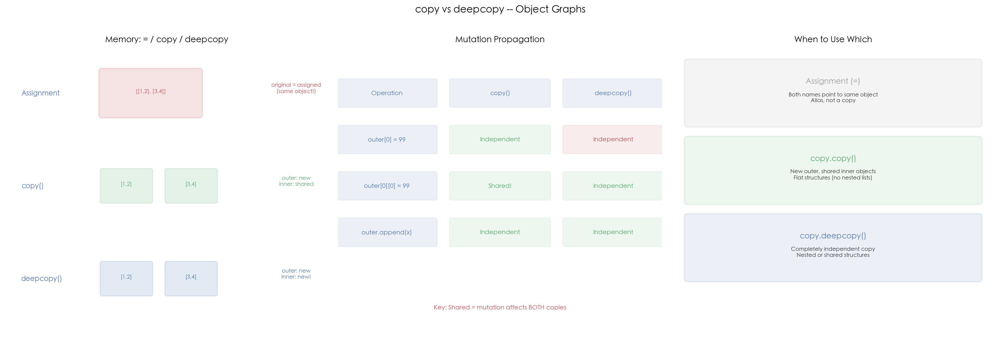

# 14 · `copy` 与 `deepcopy`：浅拷贝与深拷贝的内存真相

## 1. 引言

Python 中"复制一个对象"看似简单，实则暗藏玄机。`=` 赋值只是绑定新名字，`copy.copy()` 做浅拷贝（共享内层可变对象），`copy.deepcopy()` 做深拷贝（递归复制所有层级的对象）。三者在内存行为上截然不同，面试中几乎必考。

本文通过六个 Demo 逐步演示赋值、浅拷贝、深拷贝在嵌套列表、不可变对象、自定义类和循环引用场景下的行为差异，并通过可视化直观展示内存模型。

## 2. 文件结构

```
14_copy_deepcopy/
├── README.md              # 本教程文档
├── copy_deepcopy.py       # 主演示脚本：= vs copy vs deepcopy 全场景对比
├── scripts/
│   └── gen_diagram.py # 示意图生成脚本（三面板机制示意图）
└── images/
    └── copy_deepcopy.png  # 三面板可视化（由 gen_diagram.py 生成）
```

主脚本内容：

```
copy_deepcopy.py
├── 1. demo_basics()      # = vs copy vs deepcopy 基础对比
├── 2. demo_immutable()   # 不可变对象的 copy 行为
├── 3. Node + __copy__()  # 自定义浅拷贝（链表节点）
├── 4. demo_cyclic()      # deepcopy 处理循环引用
└── 5. run_demo()         # 汇总演示 + 内存 id 对比
```

## 3. 核心概念

### 3.1 赋值 (=) vs 浅拷贝 vs 深拷贝

```python
original = [[1, 2], [3, 4]]
assigned = original       # = 赋值：同一对象
shallow  = copy.copy(original)   # 浅拷贝：外层新，内层共享
deep     = copy.deepcopy(original) # 深拷贝：全部独立
```

修改内层元素 `original[0][0] = 99` 后：

| 操作 | `assigned` | `shallow` | `deep` |
|:---|:---|:---|:---|
| `original is x` | `True` | `False` | `False` |
| `x[0][0]` 的值 | **99（共享）** | **99（共享）** | **1（独立）** |

`=` 赋值不创建副本，两个名字指向同一个对象；`copy.copy()` 创建了新的外层列表，但内层子列表仍然是同一个引用；`copy.deepcopy()` 递归复制所有层级的对象，完全独立。

### 3.2 修改传播规律

```
outer[0] = 99        → copy 和 deepcopy 都独立（替换外层引用）
outer[0][0] = 99     → copy 共享！（修改内层可变对象）
outer.append(x)      → copy 和 deepcopy 都独立（外层操作）
```

**关键规则**：浅拷贝只保证外层容器独立，修改内层可变对象会同时影响原对象和浅拷贝。这就是浅拷贝最容易被忽视的坑。

### 3.3 不可变对象的特殊行为

```python
a = (1, 2, [3, 4])
b = copy.copy(a)      # a is b == True（不可变，copy 返回自身）
c = copy.deepcopy(a)   # a is c == False（deepcopy 仍创建新对象）
```

对不可变对象（`tuple`、`int`、`str`、`frozenset`），`copy.copy()` 直接返回对象自身（因为不可变，无需复制）。但注意 tuple 内部包含可变对象时，`copy` 和 `deepcopy` 的差异依然存在：

```python
a[2].append(5)  # 修改内部可变列表
b[2]  # [3, 4, 5] —— 共享！
c[2]  # [3, 4]    —— 独立
```

### 3.4 自定义 __copy__ 协议

通过实现 `__copy__()` 方法，可以自定义类的浅拷贝行为：

```python
class Node:
    def __init__(self, val, next_=None):
        self.val = val
        self.next = next_

    def __copy__(self):
        """浅拷贝: 只复制当前节点，共享 next 链"""
        return Node(self.val, self.next)
```

```python
n3 = Node(1, Node(2, Node(3)))  # 1 -> 2 -> 3 -> None
n3_copy = copy.copy(n3)
n3 is n3_copy           # False（新对象）
n3.next is n3_copy.next # True（共享后续链）
```

类似地，`__deepcopy__(memo)` 可自定义深拷贝行为。`memo` 字典用于处理循环引用的去重。

### 3.5 循环引用

```python
a = [1, 2]
a.append(a)  # 自引用：a[2] is a == True
b = copy.deepcopy(a)  # 正确处理！b[2] is b == True
```

`deepcopy` 通过 `memo` 字典记录已复制的对象 id，遇到重复引用时直接复用，因此能正确处理任意复杂的循环引用，不会无限递归。这是面试中高频追问点。

### 3.6 高频追问

**Q1: `copy.copy()` 和切片 `[:]` 有什么区别？**

对于列表，`copy.copy(lst)` 和 `lst[:]` 效果相同，都是浅拷贝。但 `copy.copy()` 适用于所有容器类型（dict、set 等），而切片只适用于序列类型。

**Q2: `deepcopy` 的 `memo` 参数是什么？**

`memo` 是一个字典，`deepcopy` 在递归过程中用 `id(obj) -> copied_obj` 记录已复制的对象。作用有两个：
- **去重**：避免同一对象被多次复制，保持引用共享关系
- **处理循环引用**：检测到已访问对象时直接返回，防止无限递归

**Q3: 什么时候用 `copy`，什么时候用 `deepcopy`？**

- **浅拷贝**：结构扁平（列表中只有不可变元素），或有意共享内层对象（如多视图共享同一数据）
- **深拷贝**：结构嵌套（列表中包含列表/字典），需要完全独立的副本
- **经验法则**：不确定时用 `deepcopy`（更安全，但稍慢）

**Q4: 字典和集合的拷贝行为？**

- `d.copy()` 等价于 `copy.copy(d)`，都是浅拷贝
- `copy.deepcopy(d)` 递归复制所有 key 和 value
- `set.copy()` 同理

## 4. 实操演示

```bash
cd interview/14_copy_deepcopy
python3 copy_deepcopy.py       # 运行 demo（无需 matplotlib）
python3 scripts/gen_diagram.py # 重新生成 images/copy_deepcopy.png
```

真实输出示例（macOS, CPython 3.10）：

```
[1] Assignment vs Copy vs Deepcopy:
  original[0][0] = 99:
    assigned[0][0] = 99  (shared!)
    shallow[0][0]  = 99   (shared!)
    deep[0][0]     = 1     (independent)
    original is assigned: True
    original is shallow:  False
    original is deep:     False

[2] Immutable objects:
  a = (1, 2, [3, 4])
  a is b (copy): True  (tuple copy returns self)
  a is c (deepcopy): False  (deepcopy creates new)
  a[2].append(5):
    b[2] = [3, 4, 5]  (shared inner list!)
    c[2] = [3, 4]  (independent)

[4] Cyclic reference:
  a = [1, 2, a]  (cyclic)
  a[2] is a: True
  deepcopy(a): OK
  b[2] is b: True  (cycle preserved)
```

## 5. 预期结果与陷阱



上图三面板展示了 `copy` 与 `deepcopy` 的核心差异：

- **左图 — 内存模型**：赋值（红色）指向同一对象；浅拷贝（绿色）外层新容器、内层共享；深拷贝（蓝色）所有层级都独立
- **中图 — 修改传播表**：列出不同修改操作对浅拷贝和深拷贝的影响，`outer[0][0] = 99` 是浅拷贝的陷阱
- **右图 — 使用指南**：赋值创建别名、浅拷贝适合扁平结构、深拷贝适合嵌套结构

诚实预期（本机实测）：

- `[1]`-`[4]` 的输出是**确定性的**，每次运行一致
- `[5]` 的 `id(...)` 数值每次运行都不同（内存地址由分配器决定），且小对象可能复用刚释放的地址（本机实测 `copy` 和 `deepcopy` 的 id 甚至相同）—— **不要用 id 数值本身下结论**，判断共享要用 `is`
- CPython 的小整数/字符串驻留（interning）会影响不可变对象的行为观察，但 demo 中的 list/tuple 场景不受影响

## 6. 小结

1. **`=` 赋值不创建副本**，只是给同一对象绑定新名字
2. **`copy.copy()` 浅拷贝**：外层容器独立，内层可变对象共享
3. **`copy.deepcopy()` 深拷贝**：递归复制所有层级，完全独立
4. **不可变对象 `copy()` 返回自身**，但 `deepcopy()` 仍创建新对象
5. **`__copy__` / `__deepcopy__`** 可自定义拷贝行为
6. **`deepcopy` 通过 `memo` 字典处理循环引用**，面试高频追问

下一篇进入 15_args_kwargs：看 `*args` / `**kwargs` 如何实现灵活的参数传递。
