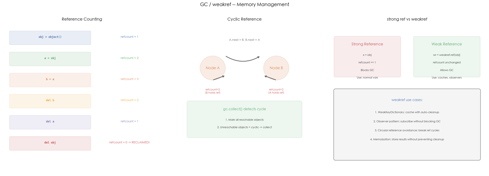

# 16 · GC、weakref 与 `__del__`：引用计数搞不定的循环引用谁来收

## 1. 引言

Python 的内存管理采用**引用计数为主、分代 GC 为辅**的双轨机制。引用计数在引用归零时立即回收对象（大多数场景）；但当对象之间存在循环引用时，引用计数永远不为 0，需要分代 GC 定期扫描发现并回收。`weakref` 模块提供不增加引用计数的弱引用，用于缓存、观察者模式等需要"引用但不阻止回收"的场景。`__del__` 是析构函数，在对象被回收前调用，但在循环引用场景下行为不可靠，面试和实践中都建议优先使用上下文管理器。

## 2. 文件结构

```
16_gc_weakref/
├── README.md              # 本教程文档
├── gc_weakref.py          # 主演示脚本：引用计数 / 循环引用 / weakref / 分代 GC
├── scripts/
│   └── gen_diagram.py # 示意图生成脚本（三面板机制示意图）
└── images/
    └── gc_weakref.png     # 三面板可视化（由 gen_diagram.py 生成）
```

主脚本内容：

```
gc_weakref.py
├── 1. demo_refcount()               # 引用计数演示（sys.getrefcount）
├── 2. Node + demo_cyclic()          # 循环引用与 gc.collect()
├── 3. demo_weakref()                # weakref.ref + finalize 回调
├── 4. demo_weakref_dict()           # WeakKeyDictionary 自动清理
└── 5. run_demo()                    # 综合演示（含 __del__ 警告、GC 分代）
```

## 3. 核心概念

### 3.1 引用计数

Python 中每个对象都维护一个引用计数（`ob_refcnt`）。引用计数归零时，对象**立即**被回收。

```
obj = object()    # refcount = 1
a = obj           # refcount = 2
b = a             # refcount = 3
del b             # refcount = 2
del a             # refcount = 1
del obj           # refcount = 0 → RECLAIMED
```

使用 `sys.getrefcount(obj)` 可以查看当前引用数（注意：函数调用本身会临时增加 1）。

引用计数简单高效，**但无法处理循环引用**。

### 3.2 循环引用

两个对象互相引用时，即使外部没有引用，它们的引用计数也永远不为 0：

```
a.next = b    → a 的 refcount += 1, b 的 refcount += 1
b.next = a    → a 的 refcount += 1, b 的 refcount += 1

del a; del b  → 外部引用消失，但 a 和 b 仍互相持有
→ refcount 永远不为 0 → 内存泄漏！
```

CPython 的分代 GC 通过**可达性分析**解决这个问题：
1. 从根集合（stack、globals）出发，标记所有可达对象
2. 不可达的对象组成循环引用 → 回收

调用 `gc.collect()` 可手动触发一轮完整回收。代码中的 `Node` 类演示了 `del a; del b` 后节点仍然存活；且由于 demo 里 `Node.all_nodes`（类属性列表）持有强引用，`gc.collect()` 也无法回收它们（见"预期结果与陷阱"）。

### 3.3 weakref 弱引用

`weakref.ref(obj)` 创建一个不增加引用计数的引用：

```python
obj = CacheEntry("user:123", {"name": "Alice"})
ref = weakref.ref(obj)

print(ref())          # <CacheEntry('user:123')>   对象存活
print(ref() is obj)   # True

del obj               # 引用归零，对象被回收
print(ref())          # None                         弱引用已失效
```

`weakref.finalize(obj, callback)` 可以注册一个回调函数，在对象被回收时自动执行。

**使用场景**：
- 缓存：存储计算结果，但不阻止原始数据被回收
- 观察者模式：被观察对象可以自由销毁，不影响观察者生命周期
- 打破循环引用：将 A→B 的强引用改为弱引用

### 3.4 WeakKeyDictionary

`WeakKeyDictionary` 是以弱引用为 key 的字典。当 key 对象被回收时，对应条目**自动删除**：

```python
cache = WeakKeyDictionary()
obj = Expensive("data1")
cache[obj] = "cached result"     # 1 entry

del obj                          # key 被回收
gc.collect()
# cache 自动清空，len(cache) == 0
```

适合实现"自动清理"的缓存：不需要手动管理缓存条目的生命周期。

### 3.5 `__del__` 的陷阱

`__del__` 在对象被回收前调用，但有几个重要风险：

| 问题 | 说明 |
|:---|:---|
| 循环引用中可能不被调用 | GC 回收循环引用时，不保证 `__del__` 执行 |
| 异常被忽略 | `__del__` 中的异常只会打印警告，不会抛出 |
| 执行顺序不可预测 | 多个对象的 `__del__` 调用顺序不确定 |
| 无法保证执行 | `gc.collect()` 清理循环引用时可能跳过有 `__del__` 的对象 |

**建议**：优先使用上下文管理器（`with` 语句）做资源清理，而不是依赖 `__del__`。

### 3.6 GC 分代

Python 的 GC 将对象分为三代（Gen 0/1/2），新对象从 Gen 0 开始：

```
Gen 0 → Gen 1 → Gen 2
(频繁扫描) → (中等) → (低频)
```

默认阈值 `(700, 10, 10)`：Gen 0 分配 700 次后触发一次扫描，存活对象晋升到 Gen 1。可以用 `gc.get_threshold()` 查看，`gc.set_threshold()` 调整。

### 3.7 高频追问

**Q1: Python 的垃圾回收机制是什么？**

引用计数为主（实时回收），分代 GC 为辅（处理循环引用）。引用计数归零立即回收，循环引用通过 `gc.collect()` 的可达性分析处理。

**Q2: 什么情况会导致内存泄漏？**

循环引用是最常见的原因。解决方法：用 `gc.collect()` 手动回收，或用 `weakref` 打破循环。

**Q3: `__del__` 为什么不推荐使用？**

在循环引用场景下 `__del__` 可能不被调用；`__del__` 中的异常被静默忽略；执行时机不可控。建议用 `with` 上下文管理器或 `atexit` 做资源清理。

**Q4: weakref 有什么实际用途？**

缓存（自动过期）、观察者模式（不阻止被观察对象回收）、打破循环引用（将强引用改为弱引用）。`WeakKeyDictionary` 和 `WeakValueDictionary` 是常用容器。

## 4. 实操演示

```bash
cd interview/16_gc_weakref
python3 gc_weakref.py          # 运行 GC / weakref demo
python3 scripts/gen_diagram.py # 重新生成 images/gc_weakref.png
```

真实输出示例（macOS, CPython 3.10）：

```
[1] Reference counting:
  obj = object()  -> refcount: 2
  a = obj         -> refcount: 3
  b = a           -> refcount: 4
  del b          -> refcount: 3
  del a          -> refcount: 2

[2] Cyclic reference (GC needed):
  Before: 0 nodes
  After del: 2 nodes (still alive!)
  gc.collect(): 22 objects collected
  After GC: 2 nodes

[3] weakref (non-blocking reference):
  ref() is obj: True
  After del obj:
  ref(): None  (dead!)
  [callback] object was garbage collected!
  alive: False

[4] WeakKeyDictionary (auto-cleanup):
  cache has 1 entries
  After del + GC: cache has 0 entries

[6] GC generations:
  Gen 2: 8007 objects
  gc.get_threshold(): (700, 10, 10)
```

## 5. 预期结果与陷阱



上图三面板展示 Python 内存管理的核心机制：
- **左图 — 引用计数**：从创建到删除的引用计数变化，`refcount=0` 时立即回收
- **中图 — 循环引用**：A.next=B / B.next=A 形成死锁，引用计数永远不为 0，需要 `gc.collect()` 通过可达性分析发现并回收
- **右图 — 强引用 vs 弱引用**：强引用 `refcount += 1` 阻止 GC，弱引用不影响引用计数、允许 GC；下方列出 weakref 的 4 种典型使用场景

诚实预期（本机实测）：

- **`getrefcount` 读数偏 1**：demo 中 `object()` 显示 refcount=2 而不是 1 —— `sys.getrefcount(obj)` 的实参传递本身临时持有一次引用，这是文档明示的行为，不是 bug
- **`gc.collect()` 后 `After GC: 2 nodes`**：Node 并没有被这轮 GC 回收，因为 `Node.all_nodes` 类属性（列表）对每个节点持有**强引用**，循环对 GC 来说是"可达"的。两个节点的 `[__del__] destroyed` 日志出现在 demo 全部结束之后（解释器退出时才销毁）—— 这恰好是"隐式强引用导致对象延迟回收"的活例子
- **`gc.collect(): 22 objects`、各代对象数（Gen 2: 8007）每次运行都会波动**：回收数量取决于解释器启动以来分配过的对象，属于预期，不要和固定值对比
- weakref 失效（`ref(): None`）、finalize 回调、`WeakKeyDictionary` 自动清空在 CPython 中稳定可复现

## 6. 小结

1. **引用计数 = 主回收机制**，`refcount=0` 立即回收，高效但处理不了循环引用
2. **分代 GC = 辅回收机制**，定期扫描发现循环引用并通过可达性分析回收
3. **weakref 不增加引用计数**，用于缓存、观察者模式、打破循环引用
4. **`__del__` 不可靠**，优先用上下文管理器做资源清理

下一篇进入 17_property：看 `@property` 如何把方法伪装成属性，实现受控的属性读写。
