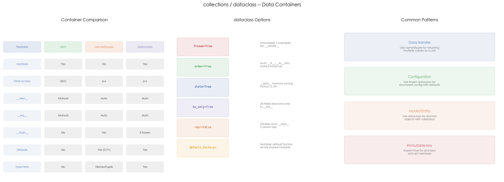

# 19 · collections 与 dataclass：结构化数据容器的选型之道

## 1. 引言

Python 提供多种数据容器来组织结构化数据：`dict` 是最通用的键值对，`namedtuple` 提供不可变的命名字段访问，`dataclass`（Python 3.7+）则在灵活性和代码简洁性之间取得了最佳平衡。三者各有适用场景，面试中"namedtuple 和 dataclass 怎么选"是高频题。

本文从 `collections.namedtuple` 出发，逐步介绍 `typing.NamedTuple`、可变/frozen `dataclass`、嵌套 dataclass，并通过可视化对比三种容器的特性和适用场景。

## 2. 文件结构

```
19_collections/
├── README.md              # 本教程文档
├── collections.py         # 主演示脚本：namedtuple / NamedTuple / dataclass
├── scripts/
│   └── gen_diagram.py # 示意图生成脚本（三面板对比图）
└── images/
    └── collections.png    # 三面板可视化（由 gen_diagram.py 生成）
```

主脚本内容：

```
collections.py
├── 1. Point / Color (namedtuple)       # 经典命名元组
├── 2. TypedPoint (NamedTuple)          # 带类型注解的命名元组
├── 3. Product (dataclass, mutable)      # 可变数据类 + __post_init__
├── 4. Version (dataclass, frozen)       # 不可变数据类 + 排序
├── 5. Address / Employee (nested)       # 嵌套数据类
└── 6. run_demo()                        # 汇总演示
```

## 3. 核心概念

### 3.1 namedtuple —— 不可变命名元组

```python
from collections import namedtuple

Point = namedtuple("Point", ["x", "y"])
p = Point(3, 4)
p.x, p.y          # 3, 4（字段名访问）
hash(p)           # 可哈希，可做 dict key
```

`namedtuple` 本质是 `tuple` 的子类，自动生成 `__repr__`、`__eq__`、`__hash__`。不可变意味着创建后无法修改字段，天然线程安全。适合轻量级数据传输（如函数返回多个值）。

```python
d = {Point(3, 4): "origin"}   # namedtuple 做 dict key
Color = namedtuple("Color", ["r", "g", "b", "name"])
c = Color(255, 0, 0, "red")
```

### 3.2 typing.NamedTuple —— 类型注解版

```python
from typing import NamedTuple

class TypedPoint(NamedTuple):
    x: float
    y: float

TypedPoint.__annotations__  # {'x': <class 'float'>, 'y': <class 'float'>}
```

`typing.NamedTuple` 和 `collections.namedtuple` 功能等价，但支持类型注解，配合 mypy/pyright 可以做静态类型检查。Python 3.6+ 可用。适合需要类型约束的项目。

### 3.3 dataclass（可变）—— 自动生成样板代码

```python
from dataclasses import dataclass, field

@dataclass
class Product:
    name: str
    price: float
    in_stock: bool = True
    tags: list = field(default_factory=list)

    def __post_init__(self):
        if self.price < 0:
            self.price = 0.0
```

`@dataclass` 自动生成 `__init__`、`__repr__`、`__eq__`。相比手写普通类，代码量减少约 50%。关键点：

- **`default_factory=list`**：避免可变默认值陷阱（所有实例共享同一个 list）。`field(default_factory=list)` 确保每次创建新实例时生成独立的 list。
- **`__post_init__`**：在 `__init__` 之后自动调用，适合做参数校验和派生字段计算。示例中将负数价格修正为 0。

```python
prod = Product("Laptop", 999.99, tags=["electronics"])
prod.price = 899.99        # 可修改
prod.tags.append("sale")  # tags 是独立列表
```

### 3.4 frozen dataclass —— 不可变 + 可排序

```python
@dataclass(frozen=True, order=True)
class Version:
    major: int
    minor: int
    patch: int = 0

versions = [Version(2, 0, 1), Version(1, 10, 0), Version(2, 0, 0)]
sorted(versions)   # [Version(1, 10, 0), Version(2, 0, 0), Version(2, 0, 1)]（repr 形式）
hash(versions[0])  # 可哈希
versions[0].major = 3  # AttributeError: frozen
```

- **`frozen=True`**：禁止修改字段，自动生成 `__hash__`，可做 dict key / set 成员
- **`order=True`**：自动生成 `__lt__`、`__le__`、`__gt__`、`__ge__`，按字段顺序依次比较

适合表示版本号、配置项等不应被修改的数据。

### 3.5 嵌套 dataclass —— 结构化组合

```python
@dataclass
class Address:
    city: str
    street: str

@dataclass
class Employee:
    name: str
    age: int
    address: Address = None

emp = Employee("Alice", 30, Address("Shanghai", "Nanjing Rd"))
from dataclasses import asdict
asdict(emp)  # {'name': 'Alice', 'age': 30, 'address': {'city': 'Shanghai', 'street': 'Nanjing Rd'}}
```

`asdict()` 递归地将 dataclass 转为嵌套字典，适合序列化（JSON 输出、API 响应）。对应地，`astuple()` 递归转为嵌套元组。

### 3.6 高频追问

**Q1: namedtuple 和 dataclass 怎么选？**

| 场景 | 推荐 |
|:---|:---|
| 轻量数据传输（函数返回值） | `namedtuple` |
| 需要类型注解 + 不可变 | `NamedTuple` |
| 需要可变性、校验、默认值 | `dataclass` |
| 不可变 + 可哈希 + 可排序 | `@dataclass(frozen=True, order=True)` |

简单规则：**简单不可变数据用 namedtuple，其余用 dataclass**。

**Q2: dataclass 的 `field(default_factory=list)` 和 `field(default=[])` 有什么区别？**

`field(default=[])` 会在类定义时直接抛 `ValueError: mutable default <class 'list'> for field ... is not allowed: use default_factory`——dataclass 自 3.7 起就拒绝 list/dict/set 字面默认值，从根上挡住了"所有实例共享同一个 list"的坑。`default_factory=list` 则在每次 `__init__` 调用时执行 `list()` 创建新对象。真正会踩共享陷阱的是普通函数默认参数 `def f(items=[])`，那里没有这层保护。

**Q3: frozen dataclass 能做字典键吗？**

能。`frozen=True` 自动生成 `__hash__`（基于所有字段），并且禁止修改字段，满足字典键的不可变要求。非 frozen 的 dataclass 不会生成 `__hash__`（设为 `None`），因为可变对象做哈希键会导致数据不一致。

**Q4: `asdict()` 和 `astuple()` 是浅转换还是深转换？**

深转换（递归）。嵌套的 dataclass 也会被转为 dict/tuple，嵌套的 list/dict 会被递归处理。对于包含自定义对象或循环引用的场景需要注意。

**Q5: dataclass 能继承吗？**

能，但有一些规则：
- 子类自动继承父类的字段
- `__post_init__` 不会自动调用父类的 `__post_init__`，需手动 `super().__post_init__()`
- `frozen` 子类的 `__init__` 中不能直接设值，需用 `object.__setattr__(self, 'x', value)`

## 4. 实操演示

```bash
cd interview/19_collections
python3 collections.py        # 运行容器 demo
python3 scripts/gen_diagram.py # 重新生成 images/collections.png
```

真实输出示例（macOS, CPython 3.10）：

```
[1] namedtuple:
  Point(3, 4): x=3, y=4
  repr: Point(x=3, y=4)
  hashable: 1079245023883434373 (can be dict key)
  dict key: [Point(x=3, y=4)]
  Color: Color(r=255, g=0, b=0, name='red')

[2] Typed NamedTuple:
  TypedPoint(3.5, 4.5): TypedPoint(x=3.5, y=4.5)
  __annotations__: {'x': <class 'float'>, 'y': <class 'float'>}

[3] dataclass (mutable):
  Product(name='Laptop', price=999.99, in_stock=True, tags=['electronics'])
  After modify: Product(name='Laptop', price=899.99, in_stock=True, tags=['electronics', 'sale'])
  Product('Free', -1): price=0.0 (clamped to 0)

[4] dataclass (frozen=True, order=True):
  Sorted: [Version(major=1, minor=10, patch=0), Version(major=2, minor=0, patch=0), Version(major=2, minor=0, patch=1)]
  Hashable: 7853416581674910768
  versions[0].major = 3 -> AttributeError: frozen

[5] Nested dataclass:
  Employee(name='Alice', age=30, address=Address(city='Shanghai', street='Nanjing Rd'))
  asdict: {'name': 'Alice', 'age': 30, 'address': {'city': 'Shanghai', 'street': 'Nanjing Rd'}}

[6] Conversion utilities:
  asdict(prod): ['name', 'price', 'in_stock', 'tags']
  tuple(Point(3,4)): (3, 4)

[7] Comparison guide:
  dict:      mutable, no field access, no defaults
  namedtuple: immutable, field access, lightweight
  dataclass: mutable/frozen, auto methods, flexible
  Rule: simple data transfer -> namedtuple
        need mutation/validation -> dataclass
```

## 5. 预期结果与陷阱



上图三面板展示了数据容器的核心对比：

- **左图 — 容器对比表**：dict、namedtuple、dataclass 在可变性、字段访问、`__repr__`/`__eq__`/`__hash__`、默认值、类型注解等方面的差异一目了然
- **中图 — dataclass 配置项**：`frozen=True`（不可变）、`order=True`（排序）、`slots=True`（内存优化，3.10+）、`kw_only=True`（强制关键字参数）、`repr=False`（自定义 repr）、`field(default_factory=...)`（为可变默认值生成新对象）
- **右图 — 常用模式**：数据传输用 namedtuple、配置用 frozen dataclass、领域模型用 dataclass、字典键用 frozen dataclass

诚实预期（本机实测）：

- demo 行为全部**确定性**：排序结果、frozen 的 `AttributeError`、`asdict` 递归转换在任何 CPython 3.7+ 上一致
- **`hash()` 的数值是否稳定取决于内容**：demo 里 `hash(Point(3, 4))` 基于纯 int 元组，同一版本内**可复现**；只有 str/bytes 参与哈希时才受 PYTHONHASHSEED 随机化影响。无论哪种情况都只比较"能否哈希"，不要依赖具体数值

## 6. 小结

1. **`dict`** 灵活但无结构约束，适合动态数据
2. **`namedtuple`** 不可变、轻量、自动 `__repr__`/`__eq__`/`__hash__`，适合数据传输
3. **`NamedTuple`** 在 namedtuple 基础上增加类型注解，适合需要静态检查的项目
4. **`dataclass`** 可配置可变/不可变，自动生成样板代码，`__post_init__` 支持校验
5. **`frozen=True`** 使 dataclass 不可变且可哈希，适合配置和字典键
6. **`field(default_factory=list)`** 避免可变默认值陷阱，面试必考
7. **`asdict()` / `astuple()`** 递归转换嵌套 dataclass，方便序列化

下一篇进入 20_itertools_func：看迭代器代数如何用几个组合子替代手写循环。
